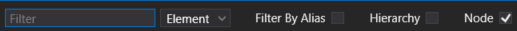
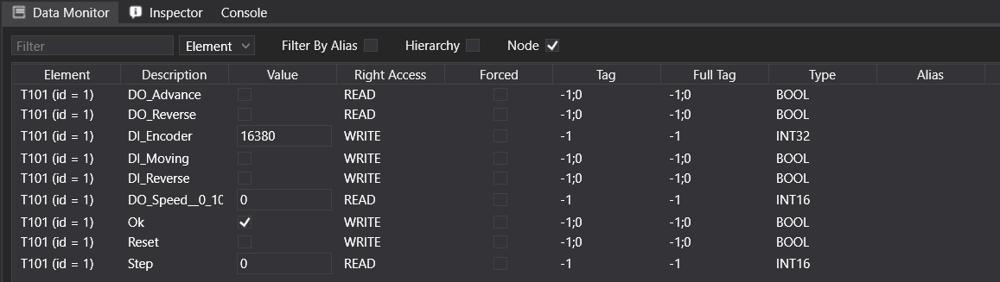

# Data Monitor :id=datamonitor

   The data monitor is a window where you can observe the state of each I/O throughout your simulation. It provides comprehensive information about each value, including its data type, current value, tag, alias, and more.
   
- [Data Monitor](#datamonitor)
	- [Toolbar](#toolbar)
   

## Toolbar :id=toolbar
   

   
- Filter By Alias : this will filter only the data that have an alias.
- Node : Tis will permit you to regroup variable together in order to find them easier.
   
> General information
   
   There are essentially two types of data: DO (Digital Output) and DI (Digital Input).
   

   
   Each mechanical groups and object has specific I/O.
   If you click at any of the column, the data will be sort alphabetically.
   
> Column description

<table>
        <tbody><tr>
            <th>Name</th>
            <th>Description</th>
        </tr>
        <tr>
            <td>Element</td>
            <td>This is the name and id of the object which belong the data.</td>
        </tr>
        
            <tr><td>Description</td>
            <td>The name of the function associate to this data.</td>
        </tr>
        
            <tr><td>Value</td>
            <td>The actual value of the data, it can be a boolean or a integer, that depends of the type of data.</td>
        </tr>
        
            <tr><td>Right Access</td>
            <td> The type of access of the data, if it is a Do, it will be a READ access, and a DI and WRITE access.</td>
        </tr>
        
            <tr><td>Forced </td>
            <td> if the data is forced, the case will be filled. It is useful to test your simulation, by forcing the data of the object you want to test. A forced data will be prioritized compared to an I/O PLC.</td>
        </tr>
            <tr><td>Tag</td>
            <td>This is the I/O address in the simulation.</td>
        </tr>
            <tr><td>Full Tag</td>
            <td>This is the full tag of the data, You can have more information here.</td>
        </tr>
            <tr><td>Type</td>
            <td>The type of the data, it can be boolean, integer or more.</td>
        </tr>
            <tr><td>Alias</td>
            <td>This is the real automate address.</td>
        </tr>
    </tbody></table>

