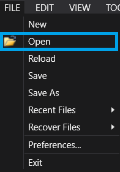

# Getting Started :id=gettingstarted

# Files Description :id=fliesdescription

It exists 4 types of files used by **<fs>[SIMETRIC]<fs> software** :

<table>
        <tbody><tr>
            <th>FILES</th>
            <th>DESCRIPTION</th>
        </tr>
        
            <tr><td>.XMC3</td>
            <td>This file is the main file of your project, with 3D models and more.</td>
        </tr>
        <tr>
            <td>.ALIAS</td>
            <td>This file is a text file, cused for the communication between <fs>[SIMETRIC]<fs> and a PLC.</td>
        </tr>
        <tr>
            <td>.CONFIG</td>
            <td>This file is useful to fully configure your project (objects, products and generators).</td>
        </tr>
        <tr>
            <td>.PNTPackage</td>
            <td>This file contains a bundle of 3D specific objects, to integrate in your 3D Project.</td>
        </tr>
</tbody></table>

# Open an existing project :id=openproject

After openning **<fs>[SIMETRIC]<fs> software**, Click on **File** > **Open**.  
A window file explorer will open to choose an existing .XMC3 project :

By default, you have access to different projects demos listed below :

- **Formation_VDemo** : *project where all the most basic objects and functions are presented.*  
- **Crochets_VDemo** : *project to train with Hook Chain functions.*  
- **Carcasse_VDemo** : *project with specific functions (Noria, particular moving products, etc.…).*  
- **Magasin_VDemo** : *project with an interface to stock products.*  
Each of them can be found in ***C:\Users\Public\Documents\IESA\PnT\Projects***.    

An other loading window will display, disable unused sections anc Click on **Load** 

# 3D Navigation :id=nav

There are 3 ways to navigate on the **3D Viewer** : 

>**MOVE CAMERA**  
You can use the **Middle Click** of the mouse or the **Arrows** in the keyboard :  
   
<video width="1000" controls>
  <source src="Medias/Button3.mp4" type="video/mp4">
</video>

>**ROTATE CAMERA**  
You can also rotate the camera by using the **Right Click** of the mouse :  
  
<video width="1000" controls>
  <source src="Medias/ClicDroit.mp4" type="video/mp4">
</video>

>**ZOOM CAMERA**  
Finally, you can zoom in and out, by using the mouse **wheel** or **+/-** of the keyboard :  
   
<video width="1000" controls>
  <source src="Medias/Wheel.mp4" type="video/mp4">
</video>

# Create your first simulation :id=firstsim

>**Create a New Scene**  
To start a brand new project, Click on **File** > **New**    
  
You can also use the keybinding  in order to open a new scene.  
<video width="1000" controls>
  <source src="Medias/New.mp4" type="video/mp4">
</video>

>**Add a Conveyor**  
To add a conveyor, **Right click** on the scene and Select **Create** > **New Object** > **Conveyors** > **Conveyor** :  
<video width="1000" controls>
  <source src="Medias/Adding.mp4" type="video/mp4">
</video>  
To **Move**, **Rotate** and **Resize** the conveyor, Select it first on the 3D and Click on the directional arrows.  
You can use the moving tools on the top bar :  
  
<video width="1000" controls>
  <source src="Medias/Move.mp4" type="video/mp4">
</video>

>Adding a Sensor

In order to fully use a conveyor, you need to add a cell to it. To know when an object is on the conveyor, and when the object is not on it anymore.

To add a conveyor to your scene, you can simply right click on the scene, and select Create>New Object>Capteurs>Cellule. The way to do it is described in the video just below.

<video width="800" controls>
  <source src="Medias/Cell.mp4" type="video/mp4">
</video>

Then you will need to place your cell on the conveyor. In order to do that, you need to simply move the cell on the conveyor with the moving tools. The way to do it is described in the video just below.

<video width="800" controls>
  <source src="Medias/Move_Cell.mp4" type="video/mp4">
</video>

You can attach a cell to a conveyor, in order to move them together, to do not have to replace the cell at the right place all the time. The way to do it is described in the video just below.

<video width="800" controls>
  <source src="Medias/Attach.mp4" type="video/mp4">
</video>

>Duplicate Object

You can regroup objects together. In order to do it, simply right click on the scene, and select Create>New Groups>Standar. And drag your object in the groups. The way to do it is described in the video just below.

<video width="800" controls>
  <source src="Medias/Group.mp4" type="video/mp4">
</video>

You can duplicate any object or groups, in order to do not repeat the creation process. To do it you need to right click on the object or groups you want to duplicate, and choose duplicate. The way to do it is described in the video just below.

<video width="800" controls>
  <source src="Medias/Duplicate.mp4" type="video/mp4">
</video>

To attach together two conveyors, it exist on the 3D Tools, a visual helper, to well link together object, such as conveyor. Make sure that the arrow are facing the same way, to have your two conveyor with the same direction. The way to do it is described in the video just below.

<video width="800" controls>
  <source src="Medias/Link.mp4" type="video/mp4">
</video>

[Resources](https://github.com/HaroldPX/Pnt<fs>[SIMETRIC]<fs>/blob/main/docs/xmc3%20Exemple/)

# Run your first simulation :id=runfirstsim

>Switching Edit & Run

To initiate the simulation, simply toggle the run/pause button. The simulation will start, and the conveyor will start moving in accordance with the code programmed within the controller. If you wish to halt the simulation and reset the environment, you can click the run/pause button again followed by the reset button.

For the next sections, we will used the simulate created previously in [creating your first simulation](#firstsim)

>Adding a product

 

To generate a product within the 3D viewer, you must first define the product in the product resources window. Afterward, click on "Add product mode" and position the product anywhere you desire within the simulation. You are able to remove any of the product by using "Remover Product Mode". 

<video width="800" controls>
  <source src="Medias/Add_Remove.mp4" type="video/mp4">
</video>

>Testing without PLC

You can force the data to take specific values to observe how your object or simulation functions. An icon will appear at the top  whenever a single data point is forced. In order to reset all the data, right click on that icon, and choose "reset all forced data". The process for forcing data is described in the video located just below this section.

<video width="800" controls>
  <source src="Medias/Forced.mp4" type="video/mp4">
</video>

You can see that the cell detect well, when a product cross the red laser trait, in the video just below.

<video width="800" controls>
  <source src="Medias/Run_Cell.mp4" type="video/mp4">
</video>

First, make sure you use the "Tapis" Conveyor, in order to command them correcly. If you are not sure that , your conveyor are "Tapis" one, you can convert them. The way to do it is described in the video just below.

<video width="800" controls>
  <source src="Medias/ToTapis.mp4" type="video/mp4">
</video>

You can forced the data to take specific value, in order to see how functions your object or simulation. You can reset all the forced data with an icon that will appear on top, whenever a single data is forced. The way to forced data is described in the video just below.

<video width="800" controls>
  <source src="Medias/Forced.mp4" type="video/mp4">
</video>

You can see that the cell detect well, when a product cross the red laser trait, in the video just below.

>Testing with PLC

In order to do not use, controller or forcing data, you can use a PLC, in order to monitor the simulation. In this page, as an example, we are going to use  a Siemens PLC.

>Aliasing I/O

First, in order to correctly link your PLC to the simulation, you need to add an automate to the communication window.

<video width="800" controls>
  <source src="Medias/PLC.mp4" type="video/mp4">
</video>

Then, you can name a data with a tag, in order to find them, in the communication window in one sight.

<video width="800" controls>
  <source src="Medias/tag.mp4" type="video/mp4">
</video>

Then, to fully link the data with the PLC, you have to address an automate to the group, then address your PLC alias to the tag you want.

<video width="800" controls>
  <source src="Medias/Alais.mp4" type="video/mp4">
</video>

>Connecting PLC

To connect our automate to the simulation, we will use IESA Link client.

# External Software :id=externalsoftware

>Virtual commissioning PLC

<table>
        <tbody><tr>
            <th>Software</th>
            <th>Uses</th>
        </tr>
        
            <tr><td>IESA Link</td>
            <td>Siemens PLC</td>
        </tr>
        <tr>
            <td>KEP Server</td>
            <td>Siemens PLC</td>
        </tr>
        <tr>
            <td>RSLink</td>
            <td>Rockwell PLC</td>
        </tr>
        <tr>
            <td>Twincat</td>
            <td>Beckroff PLC</td>
        </tr>
    </tbody></table>

>Training VR

<table>
        <tbody><tr>
            <th>Software</th>
            <th>VR Headset</th>
        </tr>
        
            <tr><td>Steam VR</td>
            <td>HTC Vive Pro 2</td>
        </tr>
        <tr>
            <td>Vive Business Streaming</td>
            <td>HTC Vive Focus 3</td>
        </tr>
        <tr>
            <td>Oculus software</td>
            <td>Oculus headset</td>
        </tr>
        <tr>
            <td>Twincat</td>
            <td>Beckroff PLC</td>
        </tr>
    </tbody></table>

