# Interface 

   To make the most of the Architect Software, we need to begin by familiarizing ourselves with the software interface and, by understanding each of its tools.
   
   
   
   Here is a list of the main tools :
   
- [Interface](#interface)
	- [Top bar](#topbar)
	- [Horizontal bar](#horizontalbar)
	- [Vertical bar](#verticalbar)
	- [Bottom bar](#bottombar)
- [3D viewer](3dviewer.md?id=3dviewer)
	- [Navigation](3dviewer.md?id=navigation)
	- [Control Gizmo](3dviewer.md?id=controlgizmo)
	- [Transformations](3dviewer.md?id=transformation)
	- [Views](3dviewer.md?id=views)
	- [Interaction](3dviewer.md?id=interaction)
- [Data monitor](datamonitor.md?id=datamonitor)
- [Hierarchy](Hierarchy.md?id=Hierarchy)
- [Console](Console.md?id=Console)
- [Library Manager](librarymanager.md?id=librarymanager)
- [Buttons Manager](buttonmanager.md?id=buttonmanager)
- [Product Manager](productmanager.md?id=productmanager)
- [Material Editor](materialeditor.md?id=materialeditor)
- [Configuration files](configurationfiles.md?id=configurationfiles)
- [Edit & Run](edit&run.md?id=edit&run)
- [VR](vr.md?id=vr)

## Top bar :id=topbar

   The toolbar is divided into two sections: the upper section is dedicated to project editing, while the lower section consists of useful tools for simulation purposes. Tools which are available section are explain in the 3D viewer section.

> File

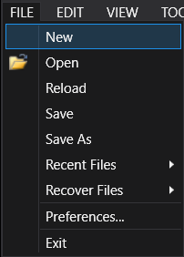

<table><tbody>
<tr><td>New</td><td> Open an empty project.</td>
<tr><td>Open</td><td> Open an existing project.</td>
<tr><td>Reload</td><td> Reload your project, in order to reset every data and maybe correct some errors.</td>
<tr><td>Save/Save As</td><td> Save your project in your computer.</td>
<tr><td>Recent Files</td><td> Load some recent project, by not open them by browsing the files explorer.</td>
<tr><td>Recover Files</td><td> List of all backup for your project. In the event that you forget to save your project or experience a software crash, you can retrieve your files With it.</td>
<tr><td>Preferences</td><td> Customization for various aspects such as the color scheme of the software interface, language preferences, the time interval for autosaves, and additional settings. More details are given here.</td>
<tr><td>Exit</td><td> Exit Architect.</td>
</tbody></table>

> Edit

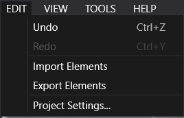

<table><tbody>
<tr><td>Undo</td><td> Undo your previous action.</td>
<tr><td>Redo</td><td> Redo your previous action.</td>
<tr><td>Import</td><td> Enables you to import elements to the hierarchy; So you will be able to import an complete complex groups.</td>
<tr><td>Export</td><td> Enables you to export elements from the hierarchy; So you will be able to export an complete complex groups to re-use it.</td>
<tr><td>Project Settings</td><td> Customize various aspects of your project. Within this window, you can specify the project name, customer name, provide a description, and configure other relevant details.</td>
</tbody></table>

> View

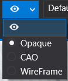

<table><tbody>
<tr><td>Windows</td><td> Open a new window of a section. 12 different section exists : 3D view, Hierarchy, Product ressources, Console, Data monitor, Inspector, Buttons, Training, VR Manager, Library Manager, Material Editor, Action Button,</td>
<tr><td>Layouts</td><td> Enable you to change sizes of each window in Architect, and also to reorganize the window as you want. You can have more detail here.</td>
<tr><td>3D Fullscreen</td><td> Expand the 3D View window to occupy the entire screen in fullscreen mode. To exit fullscreen mode, simply press Escap key.</td>
</tbody></table>

> Tools

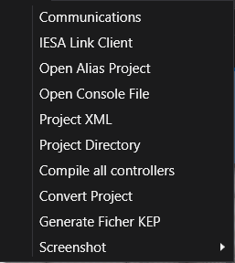

<table><tbody>
<tr><td>Communications</td><td> The communication window enable you to monitor your simulation with a PLC.</td>
<tr><td>IESA Link Client</td><td> ISEA Link Client is a software that facilitate to do the link between Architect and your PLC, such as a software like KEP or RSLink.</td>
<tr><td>Open Alias Project</td><td> The Alias project is a text file shared with IESA Link to communicate between the two software.</td>
<tr><td>Open Console File</td><td> Open the .txt file that display all the console messages.</td>
<tr><td>Project Directory</td><td> Open the place where your project is saved.</td>
<tr><td>Compile all controllers</td><td> A simple button that compile all controller at once.</td>
<tr><td>Replace Obsolete attributes</td><td> Replace the attributes that has been updated recently.</td>
<tr><td>Update Missing Parameter</td><td> Update to add new parameter added recently.</td>
<tr><td>Convert Project</td><td> Convert the project is the file you want.</td>
<tr><td>Screenshot</td><td> Take a screenshot of the 3D viewer, with an zoom option, or a screenshot from the window.</td>
</tbody></table>

> Help

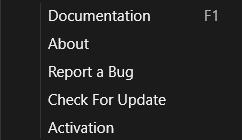

<table><tbody>
<tr><td>Documentation</td><td> Here is the documentation for Architect, which you can access at any time. Simply click on Help>Documentation or press the F1 key on your keyboard. It will redirect you to this site.</td>
<tr><td>About</td><td> Open a window, which contains, useful information about your actual Version of Architect.</td>
<tr><td>Report a Bug</td><td> display a bug reporting form, fill it the form with the necessary details and send it.</td>
<tr><td>Check For Update</td><td> If your version of Architect is not up to date, it will prompt you to download the latest version. If you already have the most recent version, it will notify you that your version is up to date.</td>
<tr><td>Activation</td><td> They are 4 different sections : a demo one, which will end in 30min; a professional one; an educational one and a ultimate one.</td>
</tbody></table>

## Horizontal bar :id=horizontalbar

> Simulation Tools

<table><tbody>
<tr><td></td><td> The Stop and Run Button enable you to run in time, or stop time your simulation. You can have more information Here</td>
<tr><td>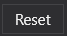</td><td> The reset button permit you to reset all data, that have been used during the simulation. You can have more information Here</td>
<tr><td>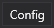</td><td> The config button permit you to select or create a config. You can have more information Here</td>
<tr><td>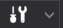</td><td> The layer buttons permits you to show or unshow some visual help, such as a grid, mechanical preview and more. You can have more information Here</td>
<tr><td>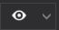</td><td> The display button enables you to switch between different views, between : CAO view opaque view or WireFrame view. You can have more information Here</td>
<tr><td></td><td> The layouts button enables you to choose among different layout. You can have more information Here</td>
</tbody></table>

> 3D Tools

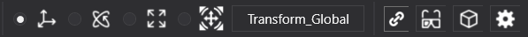

<table><tbody>
<tr><td></td><td> The translation tool permit you to move along X, Y or Z axis your object.</td>
<tr><td></td><td> The rotation tool permit you to rotate along X, Y or Z axis your object.</td>
<tr><td>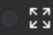</td><td> The resize tool permit you to up scale, or down scale your object.</td>
<tr><td></td><td> The universal tool permit you to move, rotate and resize in one tool an object.</td>
<tr><td>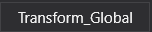</td><td> The Transform local/global tool enable you to change between the global reference or the object reference.</td>
<tr><td></td><td> The link tool enable you to link two conveyor together to be move and modify together.</td>
<tr><td>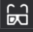</td><td> The symetry tool enable you to move an object or a group, in symmetry along an axis.</td>
<tr><td>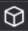</td><td> The transformation tool permit you to transform object by duplicate an object or a group.</td>
<tr><td></td><td> The align tool enables you to align your conveyors, correctly in your project.</td>
</tbody></table>

## Vertical bar :id=verticalbar

The vertical bar is useful to manipulate product and adjust your point of view, during your simulation

<table><tbody>
<tr><td></td><td> This button open on top of the 3D viewer window a panel that enables you to move, rotate and zoom the camera just by click on it.</td>
<tr><td></td><td> This button enable to select the pointer, when your mouse is not configured as a pointer.</td>
<tr><td>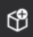</td><td> This button will permit you to add a product wherever you want in the simulation. You can see a pre-visualization, when you move your mouse.</td>
<tr><td></td><td> This button will remove from the simulation the targeted product.</td>
<tr><td></td><td> This button will enable you to drag a product during the simulation.</td>
<tr><td></td><td> This button enable you to stop in time an object during the simulation. The product will be fixed and can't move at all.</td>
<tr><td></td><td> This button will generated a product generator where you point, automatically. You need to configure it, in order to use a generator.</td>
<tr><td></td><td> This button permit you to move a cell during a simulation.</td>
<tr><td></td><td> This button enables you to measure a distance between 2 point in the simulation.</td>
<tr><td></td><td> This button permit you to settle a point of view, where you camera was when you click on the button. You will be able to see this point of view at any time.</td>
<tr><td></td><td> The spy button enables you to monitor the data of a product in a selected area, during a simulation.</td>
<tr><td></td><td> This button make the link between the simulation an you VR headset.</td>
<tr><td></td><td> This button make your point of view, in first person.</td>
</tbody></table>

## Bottom bar :id=bottombar

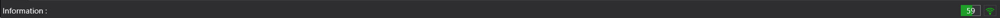

<table><tbody>
<tr><td>Information</td><td> Show some information from the object that you hovering, such as object type, CAB, 3D characteristic. 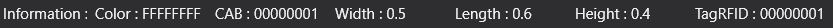</td>
<tr><td>FPS</td><td> Show you the current FPS of your 3D environment. You can optimize your FPS in Preference. 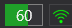</td>
</tbody></table>

