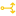

# Objects :id=objects

On this section, will be present every groups and object, with description for all of their "Inspector" attributes , that you can create from the default library. 

<table>
    <tbody><tr>
        <th>Icon</th>
        <th>Description</th>
        <th>Link</th>
    </tr>
    <tr>
        <td><a href="/#/objects.md?id=conveyors">Conveyor</a></td>
        <td>Moving belt.</td>
        <td></td>
    </tr>
    <tr>
        <td><a href="/#/objects.md?id=sensors">Sensors</a></td>
        <td>Cell and scanners.</td>
        <td></td>
    </tr>
    <tr>
        <td><a href="/#/objects.md?id=actuators">Actuators</a></td>
        <td>Object that enable a movement.</td>
        <td></td>
    </tr>
    <tr>
        <td><a href="/#/objects.md?id=decoration">Decoration</a></td>
        <td>Decoration.</td>
        <td></td>
    </tr>
    <tr>
        <td><a href="/#/objects.md?id=bands">Bands</a></td>
        <td>Specific object for band simulation.</td>
        <td></td>
    </tr>
    <tr>
        <td><a href="/#/objects.md?id=connectors">Connector I/o</a></td>
        <td>Connectors to simulate I/O communication.</td>
        <td></td>
    </tr>
    <tr>
        <td><a href="/#/objects.md?id=mix">Mix</a></td>
        <td>Specific object to move powder.</td>
        <td></td>
    </tr>
    <tr>
        <td><a href="/#/objects.md?id=handling">Handling</a></td>
        <td>Specific object to move object with handling.</td>
        <td></td>
    </tr>
    <tr>
        <td><a href="/#/objects.md?id=hookchain">Hookchains</a></td>
        <td>Specific object to move object with hookchains.</td>
        <td></td>
    </tr>
    <tr>
        <td><a href="/#/objects.md?id=vr">VR</a></td>
        <td>All object related with VR.</td>
        <td></td>
    </tr>
    <tr>
        <td><a href="/#/controllermanager.md?id=controller">Controllers</a></td>
        <td>Object that control the simulation with an IA.</td>
        <td></td>
    </tr>
    <tr>
        <td><a href="/#/objects.md?id=generator">Generator</a></td>
        <td>Objcet that can generate Product</td>
        <td></td>
    </tr>
    <tr>
        <td><a href="/#/objects.md?id=spies">Spies</a></td>
        <td>Object that control all watch evry product in specific area</td>
        <td></td>
    </tr>
</tbody></table>

# Conveyors :id=conveyors

A conveyor is a mechanical belt, uses to move product to one point to an other. They can move several object at the same time. It exists many differents types of conveyor.

<table>
    <tbody><tr>
        <th>Name</th>
        <th>Icon</th>
        <th>Description</th>
    </tr>
    <tr>
        <td><a href="/#/objects.md?id=crosstable">Cross table</a></td>
        <td></td>
        <td>Classic groups with no exclusive features.</td>
    </tr>
    <tr>
        <td><a href="/#/objects.md?id=turntable">Turn Table</a></td>
        <td></td>
        <td>Classic groups with no exclusive features.</td>
    </tr>
    <tr>
        <td><a href="/#/objects.md?id=trt">TRT</a></td>
        <td></td>
        <td>Classic groups with no exclusive features.</td>
    </tr>
    <tr>
        <td><a href="/#/objects.md?id=trtdouble">TRT Double</a></td>
        <td></td>
        <td>Classic groups with no exclusive features.</td>
    </tr>
    <tr>
        <td><a href="/#/objects.md?id=freerollers">Free Rollers</a></td>
        <td></td>
        <td>Classic groups with no exclusive features.</td>
    </tr>
    <tr>
        <td><a href="/#/objects.md?id=spiralcw">Spiral CW</a></td>
        <td></td>
        <td>Classic groups with no exclusive features.</td>
    </tr>
    <tr>
        <td><a href="/#/objects.md?id=spiralacw">Spiral ACW</a></td>
        <td></td>
        <td>Classic groups with no exclusive features.</td>
    </tr>
    <tr>
        <td><a href="/#/objects.md?id=curvedconveyor">Curved Conveyor</a></td>
        <td></td>
        <td>Classic groups with no exclusive features.</td>
    </tr>
    <tr>
        <td><a href="/#/objects.md?id=simpleconveyor">Simple Conveyor</a></td>
        <td></td>
        <td>Classic groups with no exclusive features.</td>
    </tr>
    <tr>
        <td><a href="/#/objects.md?id=conveyordrive">Conveyor Drive</a></td>
        <td></td>
        <td>Classic groups with no exclusive features.</td>
    </tr>
    <tr>
        <td><a href="/#/objects.md?id=noria">Noria</a></td>
        <td></td>
        <td>Classic groups with no exclusive features.</td>
    </tr>
</tbody></table>

## Cross Table :id=crosstable

>What is it ?

The cross table is a conveyor that posses two conveyor, one vertical and one horizontal. It allow you to move your product to all direction.

>Inspector

<table>
        <tbody><tr>
            <th>Name</th>
            <th>Description</th>
        </tr>
        <tr>
            <td>Name</td>
            <td>Name of the current section.</td>
        </tr>
        <tr>
            <td>Position</td>
            <td>Position in the 3D environment.</td>
        </tr>
        <tr>
            <td>Orientation</td>
            <td>Orientation in the 3D environment.</td>
        </tr>
        <tr>
            <td>UseEulerOriental</td>
            <td>Use the euleur Orientation to measure in radians.</td>
        </tr>
        <tr>
            <td>Description</td>
            <td>Description given to the group.</td>
        </tr>
        <tr>
            <td>Color</td>
            <td>Give a color to the belt.</td>
        </tr>
        <tr>
            <td>Color 2</td>
            <td>Give a color to the second belt.</td>
        </tr>
        <tr>
            <td>Speed</td>
            <td>Speed of the first path.</td>
        </tr>
        <tr>
            <td>Speed 2</td>
            <td>Speed of the second path.</td>
        </tr>
        <tr>
            <td>Width</td>
            <td>Width of the conveyor</td>
        </tr>
        <tr>
            <td>Feets</td>
            <td>Got feets or not.</td>
        </tr>
</tbody></table>

>Data Monitor

<table>
        <tbody><tr>
            <th>I/O</th>
            <th>Description</th>
        </tr>
            <tr><td>DO_Forward</td>
            <td>Go forward with the first speed.</td>
        </tr>
            <tr><td>DO_Backward</td>
            <td>Go backward with the first speed.</td>
        </tr>
            <tr><td>Do_Speed_0_1000</td>
            <td>Give the first speed a value.</td>
        </tr>
            <tr><td>DI_Encoder</td>
            <td>Position of the first conveyor in mm or mrad.</td>
        </tr>
            <tr><td>DO_Reset</td>
            <td>Reset the encoder to 0.</td>
        </tr>
            <tr><td>DI_Moving</td>
            <td>Read if the first conveyor is moving.</td>
        </tr>
</tbody></table>

>Specifies

>Example

## Turn Table :id=turntable

>What is it ?

The Turn table is a conveyor that will turn the product to move it into  another section.

>Inspector

<table>
        <tbody><tr>
            <th>Name</th>
            <th>Description</th>
        </tr>
        <tr>
            <td>Name</td>
            <td>Name of the current section.</td>
        </tr>
        <tr>
            <td>Position</td>
            <td>Position in the 3D environment.</td>
        </tr>
        <tr>
            <td>Orientation</td>
            <td>Orientation in the 3D environment.</td>
        </tr>
        <tr>
            <td>UseEulerOriental</td>
            <td>Use the euleur Orientation to measure in radians.</td>
        </tr>
        <tr>
            <td>Description</td>
            <td>Description given to the group.</td>
        </tr>
        <tr>
            <td>Color</td>
            <td>Give a color to the belt.</td>
        </tr>
        <tr>
            <td>Color 2</td>
            <td>Give a color to the second belt.</td>
        </tr>
        <tr>
            <td>Speed</td>
            <td>Speed of the first path.</td>
        </tr>
        <tr>
            <td>Speed 2</td>
            <td>Speed of the second path.</td>
        </tr>
        <tr>
            <td>Width</td>
            <td>Width of the conveyor</td>
        </tr>
        <tr>
            <td>Feets</td>
            <td>Got feets or not.</td>
        </tr>
</tbody></table>

>Data Monitor

<table>
        <tbody><tr>
            <th>I/O</th>
            <th>Description</th>
        </tr>
            <tr><td>DI_High</td>
            <td>Return of the max value.</td>
        </tr>
            <tr><td>DI_Low</td>
            <td>Return of the min value.</td>
		</tr>
            <tr><td>DO_Lower</td>
            <td>Go to the min value at high speed.</td>
        </tr>
            <tr><td>DO_Raise</td>
            <td>Go to the max value at high speed.</td>
        </tr>
            <tr><td>DO_Forward</td>
            <td>Go forward with the first speed.</td>
        </tr>
            <tr><td>DO_Forward 2</td>
            <td>Go forward with the second speed.</td>
        </tr>
            <tr><td>DO_Backward</td>
            <td>Go backward with the first speed.</td>
        </tr>
            <tr><td>DO_Backward 2</td>
            <td>Go backward with the second speed.</td>
        </tr>
            <tr><td>DI_Encoder</td>
            <td>Position of the first conveyor in mm or mrad.</td>
        </tr>
            <tr><td>DI_Encoder 2</td>
            <td>Position of the second conveyor in mm or mrad.</td>
        </tr>
            <tr><td>Do_Speed_0_1000</td>
            <td>Give the first speed a value.</td>
        </tr>
            <tr><td>Do_Speed2_0_1000</td>
            <td>Give the second speed a value.</td>
        </tr>
            <tr><td>DI_Moving</td>
            <td>Read if the first conveyor is moving.</td>
        </tr>
            <tr><td>DI_Moving2</td>
            <td>Read if the second conveyor is moving.</td>
        </tr>
</tbody></table>

>Specifies

>Example

## TRT :id=trt

>What is it ?

TRT is a conveyor that a conveyor that centers the product with arms

>Inspector

<table>
        <tbody><tr>
            <th>Name</th>
            <th>Description</th>
        </tr>
        <tr>
            <td>Name</td>
            <td>Name of the current section.</td>
        </tr>
        <tr>
            <td>Position</td>
            <td>Position in the 3D environment.</td>
        </tr>
        <tr>
            <td>Orientation</td>
            <td>Orientation in the 3D environment.</td>
        </tr>
        <tr>
            <td>UseEulerOriental</td>
            <td>Use the euleur Orientation to measure in radians.</td>
        </tr>
        <tr>
            <td>Description</td>
            <td>Description given to the group.</td>
        </tr>
        <tr>
            <td>Color</td>
            <td>Give a color to the belt.</td>
        </tr>
        <tr>
            <td>Color 2</td>
            <td>Give a color to the second belt.</td>
        </tr>
        <tr>
            <td>Speed</td>
            <td>Speed of the first path.</td>
        </tr>
        <tr>
            <td>Elements Lenght</td>
            <td>Lenght of the conveyor.</td>
        </tr>
        <tr>
            <td>Width</td>
            <td>Width of the conveyor</td>
        </tr>
        <tr>
            <td>Feets</td>
            <td>Got feets or not.</td>
        </tr>
        <tr>
            <td>Centered Mode</td>
            <td>Add arms to recenter the product.</td>
        </tr>
</tbody></table>

>Data Monitor

<table>
        <tbody><tr>
            <th>I/O</th>
            <th>Description</th>
		</tr>
            <tr><td>DO_Forward</td>
            <td>Go forward with the first speed.</td>
        </tr>
            <tr><td>DO_Backward</td>
            <td>Go backward with the first speed.</td>
        </tr>
            <tr><td>DI_Encoder</td>
            <td>Position of the first conveyor in mm or mrad.</td>
        </tr>
            <tr><td>DO_Reset</td>
            <td>Reset the encoder to 0.</td>
        </tr>
            <tr><td>DO_Reset_Value</td>
            <td>Reset the encoder to the value.</td>
        </tr>
            <tr><td>DI_Moving</td>
            <td>Read if the conveyor is moving forward.</td>
        </tr>
            <tr><td>DI_Reverse</td>
            <td>Read if the conveyor is moving backward.</td>
        </tr>
            <tr><td>DO_Speed_0_1000</td>
            <td>Set the speed to the value.</td>
        </tr>
</tbody></table>

>Specifies

>Example

## TRT Double :id=trtdouble

>What is it ?

TRT is a conveyor that a conveyor that centers the product with armsn both directions 

>Inspector

<table>
        <tbody><tr>
            <th>Name</th>
            <th>Description</th>
        </tr>
        <tr>
            <td>Name</td>
            <td>Name of the current section.</td>
        </tr>
        <tr>
            <td>Position</td>
            <td>Position in the 3D environment.</td>
        </tr>
        <tr>
            <td>Orientation</td>
            <td>Orientation in the 3D environment.</td>
        </tr>
        <tr>
            <td>UseEulerOriental</td>
            <td>Use the euleur Orientation to measure in radians.</td>
        </tr>
        <tr>
            <td>Description</td>
            <td>Description given to the group.</td>
        </tr>
        <tr>
            <td>Color</td>
            <td>Give a color to the belt.</td>
        </tr>
        <tr>
            <td>Color 2</td>
            <td>Give a color to the second belt.</td>
        </tr>
        <tr>
            <td>Speed</td>
            <td>Speed of the first path.</td>
        </tr>
        <tr>
            <td>Elements Lenght</td>
            <td>Lenght of the conveyor.</td>
        </tr>
        <tr>
            <td>Width</td>
            <td>Width of the conveyor</td>
        </tr>
        <tr>
            <td>Feets</td>
            <td>Got feets or not.</td>
        </tr>
        <tr>
            <td>Centered Mode</td>
            <td>Add arms to recenter the product.</td>
        </tr>
</tbody></table>

>Data Monitor

<table>
        <tbody><tr>
            <th>I/O</th>
            <th>Description</th>
		</tr>
            <tr><td>DO_Forward</td>
            <td>Go forward with the first speed.</td>
        </tr>
            <tr><td>DO_Backward</td>
            <td>Go backward with the first speed.</td>
        </tr>
            <tr><td>DI_Encoder</td>
            <td>Position of the first conveyor in mm or mrad.</td>
        </tr>
            <tr><td>DO_Reset</td>
            <td>Reset the encoder to 0.</td>
        </tr>
            <tr><td>DO_Reset_Value</td>
            <td>Reset the encoder to the value.</td>
        </tr>
            <tr><td>DI_Moving</td>
            <td>Read if the conveyor is moving forward.</td>
        </tr>
            <tr><td>DI_Reverse</td>
            <td>Read if the conveyor is moving backward.</td>
        </tr>
            <tr><td>DO_Speed_0_1000</td>
            <td>Set the speed to the value.</td>
        </tr>
</tbody></table>

>Specifies

>Example

## Free Rollers :id=freerollers

>What is it ?

>Inspector

<table>
        <tbody><tr>
            <th>Name</th>
            <th>Description</th>
        </tr>
        <tr>
            <td>Name</td>
            <td>Name of the current section.</td>
        </tr>
        <tr>
            <td>Start Position</td>
            <td>Start position of the conveyor.</td>
        </tr>
        <tr>
            <td>End Position</td>
            <td>End position of the conveyor.</td>
        </tr>
        <tr>
            <td>Color</td>
            <td>Give a color to the belt.</td>
        </tr>
        <tr>
            <td>Speed</td>
            <td>Speed of the first path.</td>
        </tr>
        <tr>
            <td>Label</td>
            <td>Name given that will appear on top of the conveyor.</td>
        </tr>
        <tr>
            <td>Width</td>
            <td>Width of the conveyor</td>
        </tr>
        <tr>
            <td>Description</td>
            <td>Description given to the group.</td>
        </tr>
        <tr>
            <td>Borders</td>
            <td>Add Borders to the edges.</td>
        </tr>
        <tr>
            <td>Feets</td>
            <td>Got feets or not.</td>
        </tr>
        <tr>
            <td>Auto Alignment</td>
            <td>Auto alignment of the product.</td>
        </tr>
        <tr>
            <td>Auto Center</td>
            <td>Auto center of the product.</td>
        </tr>
        <tr>
            <td>StopProductsWh</td>
            <td></td>
        </tr>
        <tr>
            <td>Element lenght</td>
            <td>Lenght of the conveyor.</td>
        </tr>
</tbody></table>

>Data Monitor

No attributes for this object.

>Specifies

>Example

## Spiral CW :id=spiralcw

>What is it ?

Spiral CW is a conveyor that allows the product to flow downwards like the Free Rollers, it goes clockwise.

>Inspector

<table>
        <tbody><tr>
            <th>Name</th>
            <th>Description</th>
        </tr>
        <tr>
            <td>Name</td>
            <td>Name of the current section.</td>
        </tr>
        <tr>
            <td>Position</td>
            <td>Position in the 3D environment.</td>
        </tr>
        <tr>
            <td>Orientation</td>
            <td>Orientation in the 3D environment.</td>
        </tr>
        <tr>
            <td>Description</td>
            <td>Description given to the group.</td>
        </tr>
        <tr>
            <td>UseEulerOriental</td>
            <td>Use the euleur Orientation to measure in radians.</td>
        </tr>
        <tr>
            <td>Speed</td>
            <td>Speed of the first path.</td>
        </tr>
        <tr>
            <td>Element Height</td>
            <td>Height of the conveyor.</td>
        </tr>
        <tr>
            <td>Width</td>
            <td>Width of the conveyor</td>
        </tr>
        <tr>
            <td>Radius</td>
            <td>Radius of the conveyor's curve.</td>
        </tr>
       <tr>
            <td>Angle</td>
            <td>Angle of the conveyor's curve.</td>
        </tr>
        <tr>
            <td>Auto Alignment</td>
            <td>Auto alignment of the product.</td>
        </tr>
        <tr>
            <td>Auto Center</td>
            <td>Auto center of the product.</td>
        </tr>
</tbody></table>

>Data Monitor

>Specifies

>Example

## Spiral ACW :id=spiralacw

>What is it ?

Spiral CW is a conveyor that allows the product to flow downwards like the Free Rollers, it goes anti clockwise.

>Inspector

<table>
        <tbody><tr>
            <th>Name</th>
            <th>Description</th>
        </tr>
        <tr>
            <td>Name</td>
            <td>Name of the current section.</td>
        </tr>
        <tr>
            <td>Position</td>
            <td>Position in the 3D environment.</td>
        </tr>
        <tr>
            <td>Orientation</td>
            <td>Orientation in the 3D environment.</td>
        </tr>
        <tr>
            <td>Description</td>
            <td>Description given to the group.</td>
        </tr>
        <tr>
            <td>UseEulerOriental</td>
            <td>Use the euleur Orientation to measure in radians.</td>
        </tr>
        <tr>
            <td>Speed</td>
            <td>Speed of the first path.</td>
        </tr>
        <tr>
            <td>Element Height</td>
            <td>Height of the conveyor.</td>
        </tr>
        <tr>
            <td>Width</td>
            <td>Width of the conveyor</td>
        </tr>
        <tr>
            <td>Radius</td>
            <td>Radius of the conveyor's curve.</td>
        </tr>
       <tr>
            <td>Angle</td>
            <td>Angle of the conveyor's curve.</td>
        </tr>
        <tr>
            <td>Auto Alignment</td>
            <td>Auto alignment of the product.</td>
        </tr>
        <tr>
            <td>Auto Center</td>
            <td>Auto center of the product.</td>
        </tr>
</tbody></table>

>Data Monitor

No attributes for this object.

>Specifies

>Example

## Curved Conveyor :id=curvedconveyor

>What is it ?

Curved Conveyor is conveyor to make curve.

>Inspector

<table>
        <tbody><tr>
            <th>Name</th>
            <th>Description</th>
        </tr>
        <tr>
            <td>Name</td>
            <td>Name of the current section.</td>
        </tr>
        <tr>
            <td>Position</td>
            <td>Position in the 3D environment.</td>
        </tr>
        <tr>
            <td>Orientation</td>
            <td>Orientation in the 3D environment.</td>
        </tr>
        <tr>
            <td>Description</td>
            <td>Description given to the group.</td>
        </tr>
        <tr>
            <td>UseEulerOriental</td>
            <td>Use the euleur Orientation to measure in radians.</td>
        </tr>
        <tr>
            <td>Color</td>
            <td>Color of the conveyor.</td>
        </tr>
        <tr>
            <td>Rotation CW</td>
            <td>Make the curve clockwise or anti-clockwise.</td>
        </tr>
        <tr>
            <td>Speed</td>
            <td>Speed of the first path.</td>
        </tr>
        <tr>
            <td>Width</td>
            <td>Width of the conveyor</td>
        </tr>
        <tr>
            <td>Radius</td>
            <td>Radius of the conveyor's curve.</td>
        </tr>
       <tr>
            <td>Angle</td>
            <td>Angle of the conveyor's curve.</td>
        </tr>
        <tr>
            <td>Auto Alignment</td>
            <td>Auto alignment of the product.</td>
        </tr>
        <tr>
            <td>Auto Center</td>
            <td>Auto center of the product.</td>
        </tr>
        <tr>
            <td>Feets</td>
            <td>Add feets to conveyors.</td>
        </tr>
        <tr>
            <td>StopProductsWh</td>
            <td></td>
        </tr>
</tbody></table>

>Data Monitor

<table>
        <tbody><tr>
            <th>I/O</th>
            <th>Description</th>
        </tr>
            <tr><td>DO_Forward</td>
            <td>Go forward with the first speed.</td>
        </tr>
            <tr><td>DO_Backward</td>
            <td>Go backward with the first speed.</td>
        </tr>
            <tr><td>Do_Speed_0_1000</td>
            <td>Give the first speed a value.</td>
        </tr>
            <tr><td>DI_Encoder</td>
            <td>Position of the first conveyor in mm or mrad.</td>
        </tr>
            <tr><td>DO_Reset</td>
            <td>Reset the encoder to 0.</td>
        </tr>
            <tr><td>DI_Moving</td>
            <td>Read if the first conveyor is moving.</td>
        </tr>
</tbody></table>

>Specifies

>Example

## Simple Conveyor :id=simpleconveyor

>What is it ?

Simple Conveyor is a conveyor 

>Inspector

<table>
        <tbody><tr>
            <th>Name</th>
            <th>Description</th>
        </tr>
        <tr>
            <td>Name</td>
            <td>Name of the current section.</td>
        </tr>
        <tr>
            <td>Start Position</td>
            <td>Start position of the conveyor.</td>
        </tr>
        <tr>
            <td>End Position</td>
            <td>End position of the conveyor.</td>
        </tr>
        <tr>
            <td>Color</td>
            <td>Color of the conveyor.</td>
        </tr>
        <tr>
            <td>Speed</td>
            <td>Speed of the first path.</td>
        </tr>
        <tr>
            <td>Label</td>
            <td>Name given that will appear on top of the conveyor.</td>
        </tr>
        <tr>
            <td>Width</td>
            <td>Width of the conveyor</td>
        </tr>
        <tr>
            <td>Description</td>
            <td>Description given to the group.</td>
        </tr>
        <tr>
            <td>Element Lenght</td>
            <td>lenght of the conveyor</td>
        </tr>
        <tr>
            <td>Bifilars</td>
            <td>Add the belt.</td>
        </tr>
        <tr>
            <td>Borders</td>
            <td>Add borders.</td>
        </tr>
        <tr>
            <td>Feets</td>
            <td>Add feets to conveyors.</td>
        </tr>
        <tr>
            <td>Arrow</td>
            <td>Add arrow to the belt.</td>
        </tr>
        <tr>
            <td>Auto Alignment</td>
            <td>Auto alignment of the product.</td>
        </tr>
        <tr>
            <td>Auto Center</td>
            <td>Auto center of the product.</td>
        </tr>
        <tr>
            <td>StopProductsWh</td>
            <td></td>
        </tr>
</tbody></table>

>Data Monitor

<table>
        <tbody><tr>
            <th>I/O</th>
            <th>Description</th>
        </tr>
            <tr><td>DO_Forward</td>
            <td>Go forward with the first speed.</td>
        </tr>
            <tr><td>DO_Backward</td>
            <td>Go backward with the first speed.</td>
        </tr>
            <tr><td>DI_Encoder</td>
            <td>Position of the first conveyor in mm or mrad.</td>
        </tr>
            <tr><td>DO_Reset</td>
            <td>Reset the encoder to 0.</td>
        </tr>
            <tr><td>DO_Reset_Value</td>
            <td>Reset the encoder to the value.</td>
        </tr>
            <tr><td>DI_Moving</td>
            <td>Read if the first conveyor is moving.</td>
        </tr>
            <tr><td>DI_Reverse</td>
            <td>Read if the first conveyor is moving backward.</td>
        </tr>
            <tr><td>Do_Speed_0_1000</td>
            <td>Give the first speed a value.</td>
        </tr>
</tbody></table>

>Specifies

>Example

## Conveyor Drive :id=conveyordrive

>What is it ?

Conveyor drive is a conveyor which operates with a variable speed drive . 

>Inspector

<table>
        <tbody><tr>
            <th>Name</th>
            <th>Description</th>
        </tr>
        <tr>
            <td>Name</td>
            <td>Name of the current section.</td>
        </tr>
        <tr>
            <td>Start Position</td>
            <td>Start position of the conveyor.</td>
        </tr>
        <tr>
            <td>End Position</td>
            <td>End position of the conveyor.</td>
        </tr>
        <tr>
            <td>Color</td>
            <td>Color of the conveyor.</td>
        </tr>
        <tr>
            <td>Speed</td>
            <td>Speed of the conveyor.</td>
        </tr>
        <tr>
            <td>Label</td>
            <td>Name given that will appear on top of the conveyor.</td>
        </tr>
        <tr>
            <td>Width</td>
            <td>Width of the conveyor</td>
        </tr>
        <tr>
            <td>Description</td>
            <td>Description given to the group.</td>
        </tr>
        <tr>
            <td>Element Lenght</td>
            <td>lenght of the conveyor</td>
        </tr>
        <tr>
            <td>Acceleration</td>
            <td>Acceleration of the conveyor</td>
        </tr>
        <tr>
            <td>Bifilars</td>
            <td>Add the belt.</td>
        </tr>
        <tr>
            <td>Borders</td>
            <td>Add borders.</td>
        </tr>
        <tr>
            <td>Feets</td>
            <td>Add feets to conveyors.</td>
        </tr>
        <tr>
            <td>Arrow</td>
            <td>Add arrow to the belt.</td>
        </tr>
        <tr>
            <td>Auto Alignment</td>
            <td>Auto alignment of the product.</td>
        </tr>
        <tr>
            <td>Auto Center</td>
            <td>Auto center of the product.</td>
        </tr>
        <tr>
            <td>Scaling</td>
            <td>Scale to the value the conveyor</td>
        </tr>
        <tr>
            <td>StopProductsWh</td>
            <td></td>
        </tr>
        <tr>
            <td>Element Lenght</td>
            <td>lenght of the conveyor</td>
        </tr>
</tbody></table>

>Data Monitor

<table>
        <tbody><tr>
            <th>I/O</th>
            <th>Description</th>
        </tr>
            <tr><td>DI_Moving</td>
            <td>Read if the first conveyor is moving.</td>
        </tr>
            <tr><td>DI_Reverse</td>
            <td>Read if the first conveyor is moving backward.</td>
        </tr>
            <tr><td>DI_Encoder</td>
            <td>Position of the conveyor in mm or mrad.</td>
        </tr>
            <tr><td>DO_Reset</td>
            <td>Reset the encoder to 0.</td>
        </tr>
            <tr><td>DO_Reset_Value</td>
            <td>Reset the encoder to the value.</td>
        </tr>
            <tr><td>Do_Speed_0_1000</td>
            <td>Give speed a value.</td>
        </tr>
            <tr><td>DO_Jog_Enable</td>
            <td>Enable the movement.</td>
        </tr>
            <tr><td>DO_Jog_Forward</td>
            <td>Go forward.</td>
        </tr>
            <tr><td>DO_Jog_Backward</td>
            <td>Go backward.</td>
        </tr>
            <tr><td>DO_MoveTo</td>
            <td>Move the conveyor to the value in mm.</td>
        </tr>
            <tr><td>DO_Start</td>
            <td>Start the movement.</td>
        </tr>
            <tr><td>DI_Position_OK</td>
            <td>Read if the position is reached.</td>
        </tr>
            <tr><td>DI_Speed_0_1000</td>
            <td>Read speed.</td>
        </tr>
            <tr><td>DI_RealSpeed</td>
            <td>Read real speed.</td>
        </tr>
            <tr><td>DO_Acceleration</td>
            <td>Set Acceleration to the value.</td>
        </tr>
</tbody></table>

>Specifies

>Example

## Noria :id=noria

>What is it ?

>Inspector

<table>
        <tbody><tr>
            <th>Name</th>
            <th>Description</th>
        </tr>
        <tr>
            <td>Name</td>
            <td>Name of the current section.</td>
        </tr>
        <tr>
            <td>Start Position</td>
            <td>Start position of the conveyor.</td>
        </tr>
        <tr>
            <td>End Position</td>
            <td>End position of the conveyor.</td>
        </tr>
        <tr>
            <td>Speed</td>
            <td>Speed of the first path.</td>
        </tr>
        <tr>
            <td>Label</td>
            <td>Name given that will appear on top of the conveyor.</td>
        </tr>
        <tr>
            <td>Width</td>
            <td>Width of the conveyor</td>
        </tr>
        <tr>
            <td>Description</td>
            <td>Description given to the group.</td>
        </tr>
        <tr>
            <td>Nb_Elements</td>
            <td>Number of element on the conveyor</td>
        </tr>
        <tr>
            <td>Element Lenght</td>
            <td>lenght of the conveyor</td>
        </tr>
        <tr>
            <td>Element Distance</td>
            <td>Distance between each elements.</td>
        </tr>
        <tr>
            <td>Model</td>
            <td>Choose your model.</td>
        </tr>
</tbody></table>

>Data Monitor

<table>
        <tbody><tr>
            <th>I/O</th>
            <th>Description</th>
        </tr>
            <tr><td>DO_Forward</td>
            <td>Go forward with the first speed.</td>
        </tr>
            <tr><td>DO_Backward</td>
            <td>Go backward with the first speed.</td>
        </tr>
            <tr><td>Do_Speed_0_1000</td>
            <td>Give the first speed a value.</td>
        </tr>
            <tr><td>DI_Encoder</td>
            <td>Position of the first conveyor in mm or mrad.</td>
        </tr>
            <tr><td>DI_Moving</td>
            <td>Read if the first conveyor is moving.</td>
        </tr>
            <tr><td>DI_Reverse</td>
            <td>Read if the first conveyor is moving backward.</td>
        </tr>
            <tr><td>DI_1</td>
            <td>Read 1.</td>
        </tr>
            <tr><td>DI_2</td>
            <td>Read 2.</td>
        </tr>
</tbody></table>

>Specifies

>Example

# Sensors :id=sensors

<table>
    <tbody><tr>
        <th>Name</th>
        <th>Icon</th>
        <th>Description</th>
    </tr>
    <tr>
        <td><a href="/#/objects.md?id=indicator">Indicator</a></td>
        <td></td>
        <td>Classic groups with no exclusive features.</td>
    </tr>
    <tr>
        <td><a href="/#/objects.md?id=areasensor">Area Sensor</a></td>
        <td></td>
        <td>Classic groups with no exclusive features.</td>
    </tr>
    <tr>
        <td><a href="/#/objects.md?id=contactsensor">Contact Sensor</a></td>
        <td></td>
        <td>Classic groups with no exclusive features.</td>
    </tr>
    <tr>
        <td><a href="/#/objects.md?id=photocell">Photocell</a></td>
        <td></td>
        <td>Classic groups with no exclusive features.</td>
    </tr>
    <tr>
        <td><a href="/#/objects.md?id=reader">Reader</a></td>
        <td></td>
        <td>Classic groups with no exclusive features.</td>
    </tr>
    <tr>
        <td><a href="/#/objects.md?id=profilometer">Profilometer</a></td>
        <td></td>
        <td>Classic groups with no exclusive features.</td>
    </tr>
    <tr>
        <td><a href="/#/objects.md?id=rfid">RFID</a></td>
        <td></td>
        <td>Classic groups with no exclusive features.</td>
    </tr>
    <tr>
        <td><a href="/#/objects.md?id=rotatingreader">Rotating Reader</a></td>
        <td></td>
        <td>Classic groups with no exclusive features.</td>
    </tr>
    <tr>
        <td><a href="/#/objects.md?id=telemeter">Telemeter</a></td>
        <td></td>
        <td>Classic groups with no exclusive features.</td>
    </tr>
    <tr>
        <td><a href="/#/objects.md?id=weighingscale">Weighing Scale</a></td>
        <td></td>
        <td>Classic groups with no exclusive features.</td>
    </tr>
    <tr>
        <td><a href="/#/objects.md?id=primitive">Primitive</a></td>
        <td></td>
        <td>Classic groups with no exclusive features.</td>
    </tr>
    <tr>
        <td><a href="/#/objects.md?id=gocator">Gocator</a></td>
        <td></td>
        <td>Classic groups with no exclusive features.</td>
    </tr>
</tbody></table>

## Indicator :id=indicator

>What is it ?

>Inspector

<table>
        <tbody><tr>
            <th>Name</th>
            <th>Description</th>
        </tr>
        <tr>
            <td>Name</td>
            <td>Name of the current section.</td>
        </tr>
        <tr>
            <td>Position</td>
            <td>Position in the 3D environment.</td>
        </tr>
        <tr>
            <td>Orientation</td>
            <td>Orientation in the 3D environment.</td>
        </tr>
        <tr>
            <td>Description</td>
            <td>Description given to the group.</td>
        </tr>
        <tr>
            <td>UseEulerOriental</td>
            <td>Use the euleur Orientation to measure in radians.</td>
        </tr>
        <tr>
            <td>Init Value</td>
            <td>Iniatiliaze the initail value.</td>
        </tr>
        <tr>
            <td>True Status</td>
            <td>Switch True to False.</td>
        </tr>
        <tr>
            <td>Dimension</td>
            <td>dimension of the sensor.</td>
        </tr>
        <tr>
            <td>Bistable</td>
            <td>Got many stable point.</td>
        </tr>
</tbody></table>

>Data Monitor

<table>
        <tbody><tr>
            <th>I/O</th>
            <th>Description</th>
        </tr>
            <tr><td>DO_Raise</td>
            <td>Go up.</td>
        </tr>
            <tr><td>DO_Lower</td>
            <td>Go down.</td>
        </tr>
            <tr><td>Temoin_DI</td>
            <td>Read how the sensor is moving.</td>
        </tr>
</tbody></table>

>Specifies

>Example

## Area Sensor :id=areasensor

>What is it ?

>Inspector

<table>
        <tbody><tr>
            <th>Name</th>
            <th>Description</th>
        </tr>
        <tr>
            <td>Name</td>
            <td>Name of the current section.</td>
        </tr>
        <tr>
            <td>Position</td>
            <td>Position in the 3D environment.</td>
        </tr>
        <tr>
            <td>Orientation</td>
            <td>Orientation in the 3D environment.</td>
        </tr>
        <tr>
            <td>NO_NC</td>
            <td>Normally Closed or Open</td>
        </tr>
        <tr>
            <td>Description</td>
            <td>Description given to the group.</td>
        </tr>
        <tr>
            <td>Label</td>
            <td>Display the lable on top of the sensor.</td>
        </tr>
        <tr>
            <td>Dimension</td>
            <td>dimension of the sensor.</td>
        </tr>
</tbody></table>

>Data Monitor

<table>
        <tbody><tr>
            <th>I/O</th>
            <th>Description</th>
        </tr>
            <tr><td>DI_Valeur</td>
            <td>Read the value.</td>
        </tr>
</tbody></table>

>Specifies

>Example

## Contact Sensor :id=contactsensor

>What is it ?

>Inspector

<table>
        <tbody><tr>
            <th>Name</th>
            <th>Description</th>
        </tr>
        <tr>
            <td>Name</td>
            <td>Name of the current section.</td>
        </tr>
        <tr>
            <td>Position</td>
            <td>Position in the 3D environment.</td>
        </tr>
        <tr>
            <td>Orientation</td>
            <td>Orientation in the 3D environment.</td>
        </tr>
        <tr>
            <td>NO_NC</td>
            <td></td>
        </tr>
        <tr>
            <td>Description</td>
            <td>Description given to the group.</td>
        </tr>
        <tr>
            <td>Label</td>
            <td>Display the lable on top of the sensor.</td>
        </tr>
        <tr>
            <td>Dimension</td>
            <td>dimension of the sensor.</td>
        </tr>
</tbody></table>

>Data Monitor

<table>
        <tbody><tr>
            <th>I/O</th>
            <th>Description</th>
        </tr>
            <tr><td>DI_Valeur</td>
            <td>Read the value.</td>
        </tr>
</tbody></table>

>Specifies

>Example

## photocell :id=photocell

>What is it ?

>Inspector

<table>
        <tbody><tr>
            <th>Name</th>
            <th>Description</th>
        </tr>
        <tr>
            <td>Name</td>
            <td>Name of the current section.</td>
        </tr>
        <tr>
            <td>Position</td>
            <td>Position in the 3D environment.</td>
        </tr>
        <tr>
            <td>Orientation</td>
            <td>Orientation in the 3D environment.</td>
        </tr>
        <tr>
            <td>NO_NC</td>
            <td></td>
        </tr>
        <tr>
            <td>Description</td>
            <td>Description given to the group.</td>
        </tr>
        <tr>
            <td>Label</td>
            <td>Display the lable on top of the sensor.</td>
        </tr>
        <tr>
            <td>Width</td>
            <td>Width of the conveyor.</td>
        </tr>
        <tr>
            <td>Element Height</td>
            <td>Height of the conveyor.</td>
        </tr>
        <tr>
            <td>Use Reflector</td>
            <td>Add a reflector at the end of the laser.</td>
        </tr>
</tbody></table>

>Data Monitor

<table>
        <tbody><tr>
            <th>I/O</th>
            <th>Description</th>
        </tr>
            <tr><td>DI_Valeur</td>
            <td>Read the value.</td>
        </tr>
</tbody></table>

>Specifies

>Example

## Reader :id=reader

>What is it ?

>Inspector

<table>
        <tbody><tr>
            <th>Name</th>
            <th>Description</th>
        </tr>
        <tr>
            <td>Name</td>
            <td>Name of the current section.</td>
        </tr>
        <tr>
            <td>Position</td>
            <td>Position in the 3D environment.</td>
        </tr>
        <tr>
            <td>Orientation</td>
            <td>Orientation in the 3D environment.</td>
        </tr>
        <tr>
            <td>Description</td>
            <td>Description given to the group.</td>
        </tr>
        <tr>
            <td>UseEulerOriental</td>
            <td>Use the euler Orientation to measure in radians.</td>
        </tr>
        <tr>
            <td>Dimension</td>
            <td>dimension of the sensor.</td>
        </tr>
        <tr>
            <td>DI_Data</td>
            <td></td>
        </tr>
        <tr>
            <td>Data property</td>
            <td>How the data are read</td>
        </tr>
        <tr>
            <td>Model</td>
            <td>Chosse a model among all available</td>
        </tr>
        <tr>
            <td>Azimuth</td>
            <td></td>
        </tr>
</tbody></table>

>Data Monitor

<table>
        <tbody><tr>
            <th>I/O</th>
            <th>Description</th>
        </tr>
            <tr><td>ReaderDO_Lecteur</td>
            <td>Activate the reader.</td>
        </tr>
            <tr><td>ReaderDI_Lecteur</td>
            <td>Read the reader.</td>
        </tr>
            <tr><td>ReaderDI_Data</td>
            <td>Read the reader's data.</td>
        </tr>
</tbody></table>

>Specifies

>Example

## Profilometer :id=profilometer

>What is it ?

>Inspector

<table>
        <tbody><tr>
            <th>Name</th>
            <th>Description</th>
        </tr>
        <tr>
            <td>Name</td>
            <td>Name of the current section.</td>
        </tr>
        <tr>
            <td>Position</td>
            <td>Position in the 3D environment.</td>
        </tr>
        <tr>
            <td>Orientation</td>
            <td>Orientation in the 3D environment.</td>
        </tr>
        <tr>
            <td>Description</td>
            <td>Description given to the group.</td>
        </tr>
        <tr>
            <td>UseEulerOriental</td>
            <td>Use the euleur Orientation to measure in radians.</td>
        </tr>
        <tr>
            <td>Far_Field</td>
            <td>Extend the field of the sensor.</td>
        </tr>
        <tr>
            <td>Clearance Distance</td>
            <td>Exxtend the distance of the sensor.</td>
        </tr>
        <tr>
            <td>Measurement_Ra</td>
            <td>Exxtend the distance of the sensor.</td>
        </tr>
        <tr>
            <td>Near_Field</td>
            <td>Extend the beginning of the sensor's field.</td>
        </tr>
        <tr>
            <td>Frequency</td>
            <td>Frequency between two scans.</td>
        </tr>
        <tr>
            <td>Path</td>
            <td>Point list to follow.</td>
        </tr>
        <tr>
            <td>Resolution</td>
            <td>.</td>
        </tr>
        <tr>
            <td>Index</td>
            <td>.</td>
        </tr>
        <tr>
            <td>record Snapshot</td>
            <td>.</td>
        </tr>
</tbody></table>

>Data Monitor

<table>
        <tbody><tr>
            <th>I/O</th>
            <th>Description</th>
        </tr>
            <tr><td>ProfilometerDO</td>
            <td></td>
        </tr>
            <tr><td>DI_Frame</td>
            <td>DO_Frequency</td>
        </tr>
            <tr><td>DO_Frequency</td>
            <td></td>
        </tr>
            <tr><td>DO_Command</td>
            <td></td>
        </tr>
</tbody></table>

>Specifies

>Example

## RFID :id=rfid

>What is it ?

>Inspector

<table>
        <tbody><tr>
            <th>Name</th>
            <th>Description</th>
        </tr>
        <tr>
            <td>Name</td>
            <td>Name of the current section.</td>
        </tr>
        <tr>
            <td>Position</td>
            <td>Position in the 3D environment.</td>
        </tr>
        <tr>
            <td>Orientation</td>
            <td>Orientation in the 3D environment.</td>
        </tr>
        <tr>
            <td>Description</td>
            <td>Description given to the group.</td>
        </tr>
        <tr>
            <td>UseEulerOriental</td>
            <td>Use the euleur Orientation to measure in radians.</td>
        </tr>
        <tr>
            <td>Dimension</td>
            <td>dimension of the sensor.</td>
        </tr>
        <tr>
            <td>DI_Data</td>
            <td>.</td>
        </tr>
        <tr>
            <td>DO_Data</td>
            <td>.</td>
        </tr>
</tbody></table>

>Data Monitor

<table>
        <tbody><tr>
            <th>I/O</th>
            <th>Description</th>
        </tr>
            <tr><td>DO_Read</td>
            <td>Enable the reader.</td>
        </tr>
            <tr><td>DI_Read_OK</td>
            <td>read the data.</td>
        </tr>
            <tr><td>RFIDDI_DATA</td>
            <td>.</td>
        </tr>
            <tr><td>DO_Write_OK</td>
            <td>.</td>
        </tr>
            <tr><td>RFIDDO_DATA</td>
            <td>.</td>
        </tr>
            <tr><td>DI_Presence</td>
            <td>.</td>
        </tr>
</tbody></table>

>Specifies

>Example

## Rotating Reader :id=rotatingreader

>What is it ?

>Inspector

<table>
        <tbody><tr>
            <th>Name</th>
            <th>Description</th>
        </tr>
        <tr>
            <td>Name</td>
            <td>Name of the current section.</td>
        </tr>
        <tr>
            <td>Position</td>
            <td>Position in the 3D environment.</td>
        </tr>
        <tr>
            <td>Orientation</td>
            <td>Orientation in the 3D environment.</td>
        </tr>
        <tr>
            <td>Description</td>
            <td>Description given to the group.</td>
        </tr>
        <tr>
            <td>UseEulerOriental</td>
            <td>Use the euler Orientation to measure in radians.</td>
        </tr>
        <tr>
            <td>Dimension</td>
            <td>dimension of the sensor.</td>
        </tr>
        <tr>
            <td>DI_Data</td>
            <td></td>
        </tr>
        <tr>
            <td>Data property</td>
            <td>How the data are read</td>
        </tr>
        <tr>
            <td>ReverseASCII</td>
            <td>Turn ASCII into X.</td>
        </tr>
</tbody></table>

>Data Monitor

<table>
        <tbody><tr>
            <th>I/O</th>
            <th>Description</th>
        </tr>
            <tr><td>RotatingReaderDO_Lecteur</td>
            <td>Activate the Rotating reader.</td>
        </tr>
            <tr><td>RotatingReaderDI_Data</td>
            <td>Read the Rotating reader's data.</td>
        </tr>
            <tr><td>RotatingReaderDI_Lecteur</td>
            <td>Read the Rotating reader.</td>
        </tr>
            <tr><td>RotatingReaderDO_Rotation</td>
            <td>Rotate the Rotating reader.</td>
        </tr>
</tbody></table>

>Specifies

>Example

## Telemeter :id=telemeter

>What is it ?

>Inspector

<table>
        <tbody><tr>
            <th>Name</th>
            <th>Description</th>
        </tr>
        <tr>
            <td>Name</td>
            <td>Name of the current section.</td>
        </tr>
        <tr>
            <td>Position</td>
            <td>Position in the 3D environment.</td>
        </tr>
        <tr>
            <td>Orientation</td>
            <td>Orientation in the 3D environment.</td>
        </tr>
        <tr>
            <td>Description</td>
            <td>Description given to the group.</td>
        </tr>
        <tr>
            <td>UseEulerOriental</td>
            <td>Use the euleur Orientation to measure in radians.</td>
        </tr>
        <tr>
            <td>Element lenght</td>
            <td>Lenght of the sensor.</td>
        </tr>
</tbody></table>

>Data Monitor

<table>
        <tbody><tr>
            <th>I/O</th>
            <th>Description</th>
        </tr>
            <tr><td>DO_Read</td>
            <td>Activate the telemeter.</td>
        </tr>
            <tr><td>TelemeterDI_Lecture_OK</td>
            <td>Read the Telemeter data.</td>
        </tr>
            <tr><td>TelemeterDI_Codeur</td>
            <td>Read the Encoder.</td>
        </tr>
</tbody></table>

>Specifies

>Example

## Weighing Scale :id=weighingscale

>What is it ?

>Inspector

<table>
        <tbody><tr>
            <th>Name</th>
            <th>Description</th>
        </tr>
        <tr>
            <td>Name</td>
            <td>Name of the current section.</td>
        </tr>
        <tr>
            <td>Position</td>
            <td>Position in the 3D environment.</td>
        </tr>
        <tr>
            <td>Orientation</td>
            <td>Orientation in the 3D environment.</td>
        </tr>
        <tr>
            <td>Description</td>
            <td>Description given to the group.</td>
        </tr>
        <tr>
            <td>UseEulerOriental</td>
            <td>Use the euleur Orientation to measure in radians.</td>
        </tr>
        <tr>
            <td>Dimension</td>
            <td>dimension of the sensor.</td>
        </tr>
        <tr>
            <td>Label</td>
            <td>Display the lable on top of the sensor.</td>
        </tr>
</tbody></table>

>Data Monitor

<table>
        <tbody><tr>
            <th>I/O</th>
            <th>Description</th>
        </tr>
            <tr><td>DI_Weight</td>
            <td>Read the weight of the product.</td>
        </tr>
            <tr><td>DI_Weight_OK</td>
            <td>Read if the weight is correct.</td>
        </tr>
</tbody></table>

>Specifies

>Example

## Primitive :id=primitive

>What is it ?

>Inspector

<table>
        <tbody><tr>
            <th>Name</th>
            <th>Description</th>
        </tr>
        <tr>
            <td>Name</td>
            <td>Name of the current section.</td>
        </tr>
        <tr>
            <td>Position</td>
            <td>Position in the 3D environment.</td>
        </tr>
        <tr>
            <td>Orientation</td>
            <td>Orientation in the 3D environment.</td>
        </tr>
        <tr>
            <td>Description</td>
            <td>Description given to the group.</td>
        </tr>
        <tr>
            <td>UseEulerOriental</td>
            <td>Use the euleur Orientation to measure in radians.</td>
        </tr>
        <tr>
            <td>Dimension</td>
            <td>dimension of the sensor.</td>
        </tr>
        <tr>
            <td>Label</td>
            <td>Display the lable on top of the sensor.</td>
        </tr>
        <tr>
            <td>Color_ARGB</td>
            <td>Choose a color for the sensor.</td>
        </tr>
        <tr>
            <td>Selectable</td>
            <td></td>
        </tr>
        <tr>
            <td>Physicalize</td>
            <td>Will not pass through object that physicalize too.</td>
        </tr>
        <tr>
            <td>Detectable</td>
            <td>Will be detectable by other sensor.</td>
        </tr>
        <tr>
            <td>Material</td>
            <td>Choose a material for the sensor.</td>
        </tr>
        <tr>
            <td>Texturetiling</td>
            <td>.</td>
        </tr>
        <tr>
            <td>Primitive</td>
            <td>.</td>
        </tr>
        <tr>
            <td>Friction</td>
            <td>.</td>
        </tr>
        <tr>
            <td>DI_CollisionInfo</td>
            <td>.</td>
        </tr>
        <tr>
            <td>ExactCollision</td>
            <td>.</td>
        </tr>
</tbody></table>

>Data Monitor

<table>
        <tbody><tr>
            <th>I/O</th>
            <th>Description</th>
        </tr>
            <tr><td>Primitive Sensor</td>
            <td>.</td>
        </tr>
            <tr><td>DO_Highlight</td>
            <td>.</td>
        </tr>
            <tr><td>DO_Start</td>
            <td>Start the sensor.</td>
        </tr>
</tbody></table>

>Specifies

>Example

## Gocator :id=gocator

>What is it ?

>Inspector

<table>
        <tbody><tr>
            <th>Name</th>
            <th>Description</th>
        </tr>
        <tr>
            <td>Name</td>
            <td>Name of the current section.</td>
        </tr>
        <tr>
            <td>Position</td>
            <td>Position in the 3D environment.</td>
        </tr>
        <tr>
            <td>Orientation</td>
            <td>Orientation in the 3D environment.</td>
        </tr>
        <tr>
            <td>Description</td>
            <td>Description given to the group.</td>
        </tr>
        <tr>
            <td>UseEulerOriental</td>
            <td>Use the euleur Orientation to measure in radians.</td>
        </tr>
        <tr>
            <td>Far_Field</td>
            <td>Extend the field of the sensor.</td>
        </tr>
        <tr>
            <td>Clearance Distance</td>
            <td>Exxtend the distance of the sensor.</td>
        </tr>
        <tr>
            <td>Measurement_Ra</td>
            <td>Exxtend the distance of the sensor.</td>
        </tr>
        <tr>
            <td>Near_Field</td>
            <td>Extend the beginning of the sensor's field.</td>
        </tr>
        <tr>
            <td>Frequency</td>
            <td>Frequency between two scans.</td>
        </tr>
        <tr>
            <td>UseOrigin</td>
            <td>.</td>
        </tr>
</tbody></table>

>Data Monitor

<table>
        <tbody><tr>
            <th>I/O</th>
            <th>Description</th>
        </tr>
            <tr><td>ProfilometerDO</td>
            <td></td>
        </tr>
            <tr><td>DI_Frame</td>
            <td>DO_Frequency</td>
        </tr>
            <tr><td>DO_Frequency</td>
            <td></td>
        </tr>
            <tr><td>DO_Command</td>
            <td></td>
        </tr>
</tbody></table>

>Specifies

>Example

# Actuators :id=actuators

<table>
    <tbody><tr>
        <th>Name</th>
        <th>Icon</th>
        <th>Description</th>
    </tr>
    <tr>
        <td><a href="/#/objects.md?id=centeringdevice">Centering Device</a></td>
        <td></td>
        <td>Classic groups with no exclusive features.</td>
    </tr>
    <tr>
        <td><a href="/#/objects.md?id=gripper1axe">Gripper 1 Axis</a></td>
        <td></td>
        <td>Classic groups with no exclusive features.</td>
    </tr>
    <tr>
        <td><a href="/#/objects.md?id=gripper2axe">Gripper 2 Axis</a></td>
        <td></td>
        <td>Classic groups with no exclusive features.</td>
    </tr>
    <tr>
        <td><a href="/#/objects.md?id=horsehead">Horse Head</a></td>
        <td></td>
        <td>Classic groups with no exclusive features.</td>
    </tr>
    <tr>
        <td><a href="/#/objects.md?id=hydraulicpump">Hydraulic Pump</a></td>
        <td></td>
        <td>Classic groups with no exclusive features.</td>
    </tr>
    <tr>
        <td><a href="/#/objects.md?id=pusherstepbystep">Pusher Step by Step</a></td>
        <td></td>
        <td>Classic groups with no exclusive features.</td>
    </tr>
    <tr>
        <td><a href="/#/objects.md?id=singulator">Singulator</a></td>
        <td></td>
        <td>Classic groups with no exclusive features.</td>
    </tr>
    <tr>
        <td><a href="/#/objects.md?id=tulip">Tulip</a></td>
        <td></td>
        <td>Classic groups with no exclusive features.</td>
    </tr>
    <tr>
        <td><a href="/#/objects.md?id=saw">Saw</a></td>
        <td></td>
        <td>Classic groups with no exclusive features.</td>
    </tr>
    <tr>
        <td><a href="/#/objects.md?id=jackik">Jack IK</a></td>
        <td></td>
        <td>Classic groups with no exclusive features.</td>
    </tr>
</tbody></table>

## Centering Device :id=centeringdevice

>What is it ?

>Inspector

<table>
        <tbody><tr>
            <th>Name</th>
            <th>Description</th>
        </tr>
        <tr>
            <td>Name</td>
            <td>Name of the current section.</td>
        </tr>
        <tr>
            <td>Position</td>
            <td>Position in the 3D environment.</td>
        </tr>
        <tr>
            <td>Orientation</td>
            <td>Orientation in the 3D environment.</td>
        </tr>
        <tr>
            <td>Description</td>
            <td>Description given to the group.</td>
        </tr>
        <tr>
            <td>UseEulerOriental</td>
            <td>Use the euleur Orientation to measure in radians.</td>
        </tr>
        <tr>
            <td>Width</td>
            <td>Width of the actuator.</td>
        </tr>
</tbody></table>

>Data Monitor

<table>
        <tbody><tr>
            <th>I/O</th>
            <th>Description</th>
        </tr>
            <tr><td>DO_Close</td>
            <td>Close the centering device.</td>
        </tr>
            <tr><td>DO_Open</td>
            <td>Open the centering device.</td>
        </tr>
            <tr><td>DI_Openned</td>
            <td>Read if the centering device is open.</td>
        </tr>
            <tr><td>DI_Closed</td>
            <td>Read if the centering device is close.</td>
        </tr>
            <tr><td>DI_Presence</td>
            <td>Read if a product is in the device.</td>
        </tr>
            <tr><td>DO_Jog2_Enable</td>
            <td>Activate the centering device.</td>
        </tr>
            <tr><td>DO_Jog2_Forward</td>
            <td>Move forward the centering device.</td>
        </tr>
            <tr><td>DO_Jog2_Backward</td>
            <td>Move backward the centering device.</td>
        </tr>
            <tr><td>DO_MoveTo2</td>
            <td>Move by the value.</td>
        </tr>
            <tr><td>DO_Start</td>
            <td>Start the movement.</td>
        </tr>
            <tr><td>DO_Speed2_0_1000</td>
            <td>Set the speed to the value.</td>
        </tr>
            <tr><td>DI_Moving2</td>
            <td>Read if the device is moving.</td>
        </tr>
            <tr><td>DI_Encoder2</td>
            <td>Read the encoder.</td>
        </tr>
            <tr><td>DO_Reset</td>
            <td>Reset the encoder to 0.</td>
        </tr>
        <tr><td>DO_Reset_Value</td>
            <td>Reset the encoder to the value.</td>
        </tr>
</tbody></table>

>Specifies

>Example

## Gripper 1 Axis/ :id=gripper1axe

>What is it ?

>Inspector

<table>
        <tbody><tr>
            <th>Name</th>
            <th>Description</th>
        </tr>
        <tr>
            <td>Name</td>
            <td>Name of the current section.</td>
        </tr>
        <tr>
            <td>Position</td>
            <td>Position in the 3D environment.</td>
        </tr>
        <tr>
            <td>Orientation</td>
            <td>Orientation in the 3D environment.</td>
        </tr>
        <tr>
            <td>Description</td>
            <td>Description given to the group.</td>
        </tr>
        <tr>
            <td>UseEulerOriental</td>
            <td>Use the euleur Orientation to measure in radians.</td>
        </tr>
</tbody></table>

>Data Monitor

<table>
        <tbody><tr>
            <th>I/O</th>
            <th>Description</th>
        </tr>
            <tr><td>DO_Jog2_Enable</td>
            <td>Activate the centering device.</td>
        </tr>
            <tr><td>DO_Jog2_Forward</td>
            <td>Move forward the centering device.</td>
        </tr>
            <tr><td>DO_Jog2_Backward</td>
            <td>Move backward the centering device.</td>
        </tr>
            <tr><td>DO_MoveTo2</td>
            <td>Move by the value.</td>
        </tr>
            <tr><td>DO_Start</td>
            <td>Start the movement.</td>
        </tr>
            <tr><td>DO_Speed2_0_1000</td>
            <td>Set the speed to the value.</td>
        </tr>
            <tr><td>DI_Moving2</td>
            <td>Read if the device is moving.</td>
        </tr>
            <tr><td>DI_Encoder2</td>
            <td>Read the encoder.</td>
        </tr>
            <tr><td>DI_Openned</td>
            <td>Read if the centering device is open.</td>
        </tr>
            <tr><td>DI_Closed</td>
            <td>Read if the centering device is close.</td>
        </tr>
            <tr><td>DI_Presence</td>
            <td>Read if a product is in the device.</td>
        </tr>
</tbody></table>

>Specifies

>Example

## Gripper 2 Axis :id=gripper2axe

>What is it ?

>Inspector

<table>
        <tbody><tr>
            <th>Name</th>
            <th>Description</th>
        </tr>
        <tr>
            <td>Name</td>
            <td>Name of the current section.</td>
        </tr>
        <tr>
            <td>Position</td>
            <td>Position in the 3D environment.</td>
        </tr>
        <tr>
            <td>Orientation</td>
            <td>Orientation in the 3D environment.</td>
        </tr>
        <tr>
            <td>Description</td>
            <td>Description given to the group.</td>
        </tr>
        <tr>
            <td>UseEulerOriental</td>
            <td>Use the euleur Orientation to measure in radians.</td>
        </tr>
</tbody></table>

>Data Monitor

<table>
        <tbody><tr>
            <th>I/O</th>
            <th>Description</th>
        </tr>
            <tr><td>DO_Jog_Enable</td>
            <td>Activate the first gripper.</td>
        </tr>
            <tr><td>DO_Jog_Forward</td>
            <td>Move forward the first gripper.</td>
        </tr>
            <tr><td>DO_Jog_Backward</td>
            <td>Move backward the first gripper.</td>
        </tr>
            <tr><td>DO_MoveTo</td>
            <td>Move by the value the first gripper.</td>
        </tr>
            <tr><td>DO_Start</td>
            <td>Start the movement of the first gripper.</td>
        </tr>
            <tr><td>DO_Speed_0_1000</td>
            <td>Set the first gripper's speed to the value.</td>
        </tr>
            <tr><td>DI_Moving</td>
            <td>Read if the first gripper is moving.</td>
        </tr>
            <tr><td>DI_Encoder</td>
            <td>Read the first gripper's encoder.</td>
        </tr>
            <tr><td>DO_Jog2_Enable</td>
            <td>Activate the second gripper.</td>
        </tr>
            <tr><td>DO_Jog2_Forward</td>
            <td>Move forward the second gripper.</td>
        </tr>
            <tr><td>DO_Jog2_Backward</td>
            <td>Move backward the second gripper.</td>
        </tr>
            <tr><td>DO_MoveTo2</td>
            <td>Move by the value the second gripper.</td>
        </tr>
            <tr><td>DO_Start</td>
            <td>Start the movement of the second gripper.</td>
        </tr>
            <tr><td>DO_Speed2_0_1000</td>
            <td>Set the second gripper's speed to the value.</td>
        </tr>
            <tr><td>DI_Moving2</td>
            <td>Read if the second gripper is moving.</td>
        </tr>
            <tr><td>DI_Encoder2</td>
            <td>Read the second gripper's encoder.</td>
        </tr>
            <tr><td>DI_Presence</td>
            <td>Read if a product is in the device.</td>
        </tr>
            <tr><td>DI_Openned</td>
            <td>Read if the device is open.</td>
        </tr>
            <tr><td>DI_Closed</td>
            <td>Read if the device is close.</td>
        </tr>
            <tr><td>DI_Position_OK</td>
            <td>Read if the product is well positioned in the first device.</td>
        </tr>
            <tr><td>DI_Position2_OK</td>
            <td>Read if the product is well positioned in the second device.</td>
        </tr>
</tbody></table>

>Specifies

>Example

## Horse Head :id=horsehead

>What is it ?

>Inspector

<table>
        <tbody><tr>
            <th>Name</th>
            <th>Description</th>
        </tr>
        <tr>
            <td>Name</td>
            <td>Name of the current section.</td>
        </tr>
        <tr>
            <td>Position</td>
            <td>Position in the 3D environment.</td>
        </tr>
        <tr>
            <td>Orientation</td>
            <td>Orientation in the 3D environment.</td>
        </tr>
        <tr>
            <td>Description</td>
            <td>Description given to the group.</td>
        </tr>
        <tr>
            <td>UseEulerOriental</td>
            <td>Use the euleur Orientation to measure in radians.</td>
        </tr>
</tbody></table>

>Data Monitor

<table>
        <tbody><tr>
            <th>I/O</th>
            <th>Description</th>
        </tr>
            <tr><td>DO_Raise</td>
            <td>Move up the horse head.</td>
        </tr>
            <tr><td>DO_Lower</td>
            <td>Move down the horse head.</td>
        </tr>
            <tr><td>DI_High</td>
            <td>Read if the device is up.</td>
        </tr>
            <tr><td>DI_Low</td>
            <td>Read if the device is down.</td>
        </tr>
</tbody></table>

>Specifies

>Example

## Hydraulic Pump :id=hydraulicpump

>What is it ?

>Inspector

<table>
        <tbody><tr>
            <th>Name</th>
            <th>Description</th>
        </tr>
        <tr>
            <td>Name</td>
            <td>Name of the current section.</td>
        </tr>
        <tr>
            <td>Position</td>
            <td>Position in the 3D environment.</td>
        </tr>
        <tr>
            <td>Orientation</td>
            <td>Orientation in the 3D environment.</td>
        </tr>
        <tr>
            <td>Description</td>
            <td>Description given to the group.</td>
        </tr>
        <tr>
            <td>UseEulerOriental</td>
            <td>Use the euleur Orientation to measure in radians.</td>
        </tr>
        <tr>
            <td>Label</td>
            <td>Name given that will appear on top of the device.</td>
        </tr>
</tbody></table>

>Data Monitor

<table>
        <tbody><tr>
            <th>I/O</th>
            <th>Description</th>
        </tr>
            <tr><td>DO_Flow_0_1000</td>
            <td>Set the pump's flow to this value.</td>
        </tr>
            <tr><td>DO_Pressure_0_1000</td>
            <td>Set the pump's pressure to this value.</td>
        </tr>
            <tr><td>DO_Flow_0_1000</td>
            <td>Read the pump's flow.</td>
        </tr>
            <tr><td>DO_Pressure_0_1000</td>
            <td>Read the pump's pressure.</td>
        </tr>
</tbody></table>

>Specifies

>Example

## Pusher Step by Step :id=pusherstepbystep

>What is it ?

>Inspector

<table>
        <tbody><tr>
            <th>Name</th>
            <th>Description</th>
        </tr>
        <tr>
            <td>Name</td>
            <td>Name of the current section.</td>
        </tr>
        <tr>
            <td>Position</td>
            <td>Position in the 3D environment.</td>
        </tr>
        <tr>
            <td>Orientation</td>
            <td>Orientation in the 3D environment.</td>
        </tr>
        <tr>
            <td>Description</td>
            <td>Description given to the group.</td>
        </tr>
        <tr>
            <td>UseEulerOriental</td>
            <td>Use the euleur Orientation to measure in radians.</td>
        </tr>
        <tr>
            <td>Speed</td>
            <td>Speed of the pusher.</td>
        </tr>
        <tr>
            <td>Element lenght</td>
            <td>Lenght of the pusher.</td>
        </tr>
        <tr>
            <td>Width</td>
            <td>Width of the pusher.</td>
        </tr>
</tbody></table>

>Data Monitor

<table>
        <tbody><tr>
            <th>I/O</th>
            <th>Description</th>
        </tr>
            <tr><td>DO_Close</td>
            <td>Close the pusher.</td>
        </tr>
            <tr><td>DO_Open</td>
            <td>Open the pusher.</td>
        </tr>
            <tr><td>DO_Speed_0_1000</td>
            <td>Set the speed to the value.</td>
        </tr>
            <tr><td>DI_Openned</td>
            <td>Read if the centering device is open.</td>
        </tr>
            <tr><td>DI_Closed</td>
            <td>Read if the centering device is close.</td>
        </tr>
            <tr><td>DI_Encoder</td>
            <td>Read the encoder.</td>
        </tr>
</tbody></table>

>Specifies

>Example

## Singulator :id=singulator

>What is it ?

>Inspector

<table>
        <tbody><tr>
            <th>Name</th>
            <th>Description</th>
        </tr>
        <tr>
            <td>Name</td>
            <td>Name of the current section.</td>
        </tr>
        <tr>
            <td>Position</td>
            <td>Position in the 3D environment.</td>
        </tr>
        <tr>
            <td>Orientation</td>
            <td>Orientation in the 3D environment.</td>
        </tr>
        <tr>
            <td>Description</td>
            <td>Description given to the group.</td>
        </tr>
        <tr>
            <td>UseEulerOriental</td>
            <td>Use the euleur Orientation to measure in radians.</td>
        </tr>
        <tr>
            <td>Dimension</td>
            <td>Dimension of the pusher.</td>
        </tr>
</tbody></table>

>Data Monitor

<table>
        <tbody><tr>
            <th>I/O</th>
            <th>Description</th>
        </tr>
            <tr><td>DO_Open</td>
            <td>Open the pusher.</td>
        </tr>
            <tr><td>DO_Close</td>
            <td>Close the pusher.</td>
        </tr>
            <tr><td>DI_Closed</td>
            <td>Read if the centering device is close.</td>
        </tr>
            <tr><td>DI_Openned</td>
            <td>Read if the centering device is open.</td>
        </tr>
</tbody></table>

>Specifies

>Example

## Tulip :id=tulip

>What is it ?

>Inspector

<table>
        <tbody><tr>
            <th>Name</th>
            <th>Description</th>
        </tr>
        <tr>
            <td>Name</td>
            <td>Name of the current section.</td>
        </tr>
        <tr>
            <td>Position</td>
            <td>Position in the 3D environment.</td>
        </tr>
        <tr>
            <td>Orientation</td>
            <td>Orientation in the 3D environment.</td>
        </tr>
        <tr>
            <td>Description</td>
            <td>Description given to the group.</td>
        </tr>
        <tr>
            <td>UseEulerOriental</td>
            <td>Use the euleur Orientation to measure in radians.</td>
        </tr>
</tbody></table>

>Data Monitor

<table>
        <tbody><tr>
            <th>I/O</th>
            <th>Description</th>
        </tr>
            <tr><td>DO_Close</td>
            <td>Close the pusher.</td>
        </tr>
            <tr><td>DO_Open</td>
            <td>Open the pusher.</td>
        </tr>
            <tr><td>DI_Openned</td>
            <td>Read if the centering device is open.</td>
        </tr>
            <tr><td>DI_Closed</td>
            <td>Read if the centering device is close.</td>
        </tr>
            <tr><td>DI_Presence</td>
            <td>Read if the product is here.</td>
        </tr>
</tbody></table>

>Specifies

>Example

## Saw :id=saw

>What is it ?

>Inspector

<table>
        <tbody><tr>
            <th>Name</th>
            <th>Description</th>
        </tr>
        <tr>
            <td>Name</td>
            <td>Name of the current section.</td>
        </tr>
        <tr>
            <td>Position</td>
            <td>Position in the 3D environment.</td>
        </tr>
        <tr>
            <td>Orientation</td>
            <td>Orientation in the 3D environment.</td>
        </tr>
        <tr>
            <td>Description</td>
            <td>Description given to the group.</td>
        </tr>
        <tr>
            <td>UseEulerOriental</td>
            <td>Use the euleur Orientation to measure in radians.</td>
        </tr>
        <tr>
            <td>Dimension</td>
            <td>Dimension of the device.</td>
        </tr>
</tbody></table>

>Data Monitor

<table>
        <tbody><tr>
            <th>I/O</th>
            <th>Description</th>
        </tr>
            <tr><td>DI_Presence</td>
            <td>Read if the product is here.</td>
        </tr>
            <tr><td>DO_Start</td>
            <td>Start the saw.</td>
        </tr>
</tbody></table>

>Specifies

>Example

## Jack IK :id=jackik

>What is it ?

>Inspector

<table>
        <tbody><tr>
            <th>Name</th>
            <th>Description</th>
        </tr>
        <tr>
            <td>Name</td>
            <td>Name of the current section.</td>
        </tr>
        <tr>
            <td>Position</td>
            <td>Position in the 3D environment.</td>
        </tr>
        <tr>
            <td>Orientation</td>
            <td>Orientation in the 3D environment.</td>
        </tr>
        <tr>
            <td>Description</td>
            <td>Description given to the group.</td>
        </tr>
        <tr>
            <td>UseEulerOriental</td>
            <td>Use the euleur Orientation to measure in radians.</td>
        </tr>
        <tr>
            <td>Target</td>
            <td>First target of the device.</td>
        </tr>
        <tr>
            <td>Target2</td>
            <td>Second target of the device.</td>
        </tr>
        <tr>
            <td>Target_Position</td>
            <td>Position of the first target of the device.</td>
        </tr>
        <tr>
            <td>Target_Position_2</td>
            <td>Position of the second target of the device.</td>
        </tr>
            <tr><td>Move_Parent</td>
            <td>.</td>
        </tr>
</tbody></table>

>Data Monitor

<table>
        <tbody><tr>
            <th>I/O</th>
            <th>Description</th>
        </tr>
            <tr><td>JackIKDI_Codeur</td>
            <td>.</td>
        </tr>
</tbody></table>

>Specifies

>Example

# Decoration :id=decoration

<table>
    <tbody><tr>
        <th>Name</th>
        <th>Icon</th>
        <th>Description</th>
    </tr>
    <tr>
        <td><a href="/#/objects.md?id=gocatorbox">Gocator Box</a></td>
        <td></td>
        <td>Classic groups with no exclusive features.</td>
    </tr>
    <tr>
        <td><a href="/#/objects.md?id=border">Border</a></td>
        <td></td>
        <td>Classic groups with no exclusive features.</td>
    </tr>
    <tr>
        <td><a href="/#/objects.md?id=bundleobject">BundleObject</a></td>
        <td></td>
        <td>Classic groups with no exclusive features.</td>
    </tr>
    <tr>
        <td><a href="/#/objects.md?id=buttonbox">Button Box</a></td>
        <td></td>
        <td>Classic groups with no exclusive features.</td>
    </tr>
    <tr>
        <td><a href="/#/objects.md?id=cabinet">Cabinet</a></td>
        <td></td>
        <td>Classic groups with no exclusive features.</td>
    </tr>
    <tr>
        <td><a href="/#/objects.md?id=duckboard">Duckboard</a></td>
        <td></td>
        <td>Classic groups with no exclusive features.</td>
    </tr>
    <tr>
        <td><a href="/#/objects.md?id=fence">Fence</a></td>
        <td></td>
        <td>Classic groups with no exclusive features.</td>
    </tr>
    <tr>
        <td><a href="/#/objects.md?id=label">Label</a></td>
        <td></td>
        <td>Classic groups with no exclusive features.</td>
    </tr>
    <tr>
        <td><a href="/#/objects.md?id=light">Light</a></td>
        <td></td>
        <td>Classic groups with no exclusive features.</td>
    </tr>
    <tr>
        <td><a href="/#/objects.md?id=model">Model</a></td>
        <td></td>
        <td>Classic groups with no exclusive features.</td>
    </tr>
    <tr>
        <td><a href="/#/objects.md?id=Panel">Panel</a></td>
        <td></td>
        <td>Classic groups with no exclusive features.</td>
    </tr>
    <tr>
        <td><a href="/#/objects.md?id=primitives">Primitive</a></td>
        <td></td>
        <td>Classic groups with no exclusive features.</td>
    </tr>
    <tr>
        <td><a href="/#/objects.md?id=shape">Shape</a></td>
        <td></td>
        <td>Classic groups with no exclusive features.</td>
    </tr>
</tbody></table>

## Gocator Box :id=gocatorbox

>What is it ?

>Inspector

<table>
        <tbody><tr>
            <th>Name</th>
            <th>Description</th>
        </tr>
        <tr>
            <td>Name</td>
            <td>Name of the current section.</td>
        </tr>
        <tr>
            <td>Position</td>
            <td>Position in the 3D environment.</td>
        </tr>
        <tr>
            <td>Orientation</td>
            <td>Orientation in the 3D environment.</td>
        </tr>
        <tr>
            <td>Description</td>
            <td>Description given to the group.</td>
        </tr>
        <tr>
            <td>UseEulerOriental</td>
            <td>Use the euleur Orientation to measure in radians.</td>
        </tr>
        <tr>
            <td>Dimension</td>
            <td>Dimension of the decoration.</td>
        </tr>
</tbody></table>

>Data Monitor

<table>
        <tbody><tr>
            <th>I/O</th>
            <th>Description</th>
        </tr>
            <tr><td>DO_Close</td>
            <td>Close the centering device.</td>
        </tr>
            <tr><td>DO_Open</td>
            <td>Open the centering device.</td>
        </tr>
</tbody></table>

>Specifies

>Example

## Border :id=border

>What is it ?

>Inspector

<table>
        <tbody><tr>
            <th>Name</th>
            <th>Description</th>
        </tr>
        <tr>
            <td>Name</td>
            <td>Name of the current section.</td>
        </tr>
        <tr>
            <td>Position</td>
            <td>Position in the 3D environment.</td>
        </tr>
        <tr>
            <td>Orientation</td>
            <td>Orientation in the 3D environment.</td>
        </tr>
        <tr>
            <td>Description</td>
            <td>Description given to the group.</td>
        </tr>
        <tr>
            <td>UseEulerOriental</td>
            <td>Use the euleur Orientation to measure in radians.</td>
        </tr>
        <tr>
            <td>Element Lenght</td>
            <td>Lenght of the decoration.</td>
        </tr>
</tbody></table>

>Data Monitor

No Specific attributes.

>Specifies

>Example

## BundleObject :id=bundleobject

>What is it ?

>Inspector

<table>
        <tbody><tr>
            <th>Name</th>
            <th>Description</th>
        </tr>
        <tr>
            <td>Name</td>
            <td>Name of the current section.</td>
        </tr>
        <tr>
            <td>Position</td>
            <td>Position in the 3D environment.</td>
        </tr>
        <tr>
            <td>Orientation</td>
            <td>Orientation in the 3D environment.</td>
        </tr>
        <tr>
            <td>Description</td>
            <td>Description given to the group.</td>
        </tr>
        <tr>
            <td>UseEulerOriental</td>
            <td>Use the euleur Orientation to measure in radians.</td>
        </tr>
        <tr>
            <td>Dimension</td>
            <td>Dimension of the decoration.</td>
        </tr>
        <tr>
            <td>Bundle Name</td>
            <td>Choose the bundle.</td>
        </tr>
        <tr>
            <td>Asset Name</td>
            <td>Choose the asset.</td>
        </tr>
        <tr>
            <td>Measurable</td>
            <td>Can be measurable.</td>
        </tr>
        <tr>
            <td>Detectable</td>
            <td>Can be detectable.</td>
        </tr>
        <tr>
            <td>Custom ID</td>
            <td>Customize the object's ID.</td>
        </tr>
        <tr>
            <td>Physicalize</td>
            <td>Will not pass through object that physicalize too.</td>
        </tr>
        <tr>
            <td>gravity</td>
            <td>Is subject to gravity.</td>
        </tr>
</tbody></table>

>Data Monitor

No Specific attributes.

>Specifies

>Example

## Button Box :id=buttonbox

>What is it ?

>Inspector

<table>
        <tbody><tr>
            <th>Name</th>
            <th>Description</th>
        </tr>
        <tr>
            <td>Name</td>
            <td>Name of the current section.</td>
        </tr>
        <tr>
            <td>Position</td>
            <td>Position in the 3D environment.</td>
        </tr>
        <tr>
            <td>Orientation</td>
            <td>Orientation in the 3D environment.</td>
        </tr>
        <tr>
            <td>Description</td>
            <td>Description given to the group.</td>
        </tr>
        <tr>
            <td>UseEulerOriental</td>
            <td>Use the euleur Orientation to measure in radians.</td>
        </tr>
        <tr>
            <td>Label</td>
            <td>Name given that will appear on top of the conveyor.</td>
        </tr>
        <tr>
            <td>Dimension</td>
            <td>Dimension of the decoration.</td>
        </tr>
        <tr>
            <td>Model</td>
            <td>Choose a model.</td>
        </tr>
        <tr>
            <td>Interactive</td>
            <td>Can be measurable.</td>
        </tr>
</tbody></table>

>Data Monitor

No Specific attributes.

>Specifies

>Example

## Cabinet :id=cabinet

>What is it ?

>Inspector

<table>
        <tbody><tr>
            <th>Name</th>
            <th>Description</th>
        </tr>
        <tr>
            <td>Name</td>
            <td>Name of the current section.</td>
        </tr>
        <tr>
            <td>Position</td>
            <td>Position in the 3D environment.</td>
        </tr>
        <tr>
            <td>Orientation</td>
            <td>Orientation in the 3D environment.</td>
        </tr>
        <tr>
            <td>Description</td>
            <td>Description given to the group.</td>
        </tr>
        <tr>
            <td>UseEulerOriental</td>
            <td>Use the euleur Orientation to measure in radians.</td>
        </tr>
        <tr>
            <td>Label</td>
            <td>Name given that will appear on top of the conveyor.</td>
        </tr>
        <tr>
            <td>Dimension</td>
            <td>Dimension of the decoration.</td>
        </tr>
        <tr>
            <td>Model</td>
            <td>Choose a model.</td>
        </tr>
</tbody></table>

>Data Monitor

No Specific attributes.

>Specifies

>Example

## Duckboard :id=duckboard

>What is it ?

>Inspector

<table>
        <tbody><tr>
            <th>Name</th>
            <th>Description</th>
        </tr>
        <tr>
            <td>Name</td>
            <td>Name of the current section.</td>
        </tr>
        <tr>
            <td>Position</td>
            <td>Position in the 3D environment.</td>
        </tr>
        <tr>
            <td>Orientation</td>
            <td>Orientation in the 3D environment.</td>
        </tr>
        <tr>
            <td>Description</td>
            <td>Description given to the group.</td>
        </tr>
        <tr>
            <td>UseEulerOriental</td>
            <td>Use the euleur Orientation to measure in radians.</td>
        </tr>
        <tr>
            <td>Dimension</td>
            <td>Dimension of the decoration.</td>
        </tr>
    </tbody></table>

>Data Monitor

No Specific attributes.

>Specifies

>Example

## Fence :id=fence

>What is it ?

>Inspector

<table>
        <tbody><tr>
            <th>Name</th>
            <th>Description</th>
        </tr>
        <tr>
            <td>Name</td>
            <td>Name of the current section.</td>
        </tr>
        <tr>
            <td>Position</td>
            <td>Position in the 3D environment.</td>
        </tr>
        <tr>
            <td>Orientation</td>
            <td>Orientation in the 3D environment.</td>
        </tr>
        <tr>
            <td>Description</td>
            <td>Description given to the group.</td>
        </tr>
        <tr>
            <td>UseEulerOriental</td>
            <td>Use the euleur Orientation to measure in radians.</td>
        </tr>
        <tr>
            <td>Dimension</td>
            <td>Dimension of the decoration.</td>
        </tr>
    </tbody></table>

>Data Monitor

No Specific attributes.

>Specifies

>Example

## Label :id=label

>What is it ?

>Inspector

<table>
        <tbody><tr>
            <th>Name</th>
            <th>Description</th>
        </tr>
        <tr>
            <td>Name</td>
            <td>Name of the current section.</td>
        </tr>
        <tr>
            <td>Position</td>
            <td>Position in the 3D environment.</td>
        </tr>
        <tr>
            <td>Orientation</td>
            <td>Orientation in the 3D environment.</td>
        </tr>
        <tr>
            <td>Description</td>
            <td>Description given to the group.</td>
        </tr>
        <tr>
            <td>UseEulerOriental</td>
            <td>Use the euleur Orientation to measure in radians.</td>
        </tr>
        <tr>
            <td>Dimension</td>
            <td>Dimension of the decoration.</td>
        </tr>
        <tr>
            <td>Color ARGB</td>
            <td>Color of the decoration.</td>
        </tr>
        <tr>
            <td>Parameter text</td>
            <td>Text that will be display as Decoration.</td>
        </tr>
    </tbody></table>

>Data Monitor

No Specific attributes.

>Specifies

>Example

## Light :id=light

>What is it ?

>Inspector

<table>
        <tbody><tr>
            <th>Name</th>
            <th>Description</th>
        </tr>
        <tr>
            <td>Name</td>
            <td>Name of the current section.</td>
        </tr>
        <tr>
            <td>Position</td>
            <td>Position in the 3D environment.</td>
        </tr>
        <tr>
            <td>Orientation</td>
            <td>Orientation in the 3D environment.</td>
        </tr>
        <tr>
            <td>Description</td>
            <td>Description given to the group.</td>
        </tr>
        <tr>
            <td>UseEulerOriental</td>
            <td>Use the euleur Orientation to measure in radians.</td>
        </tr>
        <tr>
            <td>Dimension</td>
            <td>Dimension of the decoration.</td>
        </tr>
        <tr>
            <td>Lights</td>
            <td>Choose your color of your lights.</td>
        </tr>
        <tr>
            <td>Label</td>
            <td>Name given that will appear on top of the conveyor.</td>
        </tr>
        <tr>
            <td>Feets</td>
            <td>Add feets.</td>
        </tr>
    </tbody></table>

>Data Monitor

No Specific attributes.

>Specifies

>Example

## Model :id=model

>What is it ?

>Inspector

<table>
        <tbody><tr>
            <th>Name</th>
            <th>Description</th>
        </tr>
        <tr>
            <td>Name</td>
            <td>Name of the current section.</td>
        </tr>
        <tr>
            <td>Position</td>
            <td>Position in the 3D environment.</td>
        </tr>
        <tr>
            <td>Orientation</td>
            <td>Orientation in the 3D environment.</td>
        </tr>
        <tr>
            <td>Description</td>
            <td>Description given to the group.</td>
        </tr>
        <tr>
            <td>UseEulerOriental</td>
            <td>Use the euleur Orientation to measure in radians.</td>
        </tr>
        <tr>
            <td>Dimension</td>
            <td>Dimension of the decoration.</td>
        </tr>
        <tr>
            <td>Parameter text</td>
            <td>Text that will be display as Decoration..</td>
        </tr>
        <tr>
            <td>Physicalize</td>
            <td>Will not pass through object that physicalize too.</td>
        </tr>
        <tr>
            <td>Gravity</td>
            <td>Is subject to gravity.</td>
        </tr>
    </tbody></table>

>Data Monitor

No Specific attributes.

>Specifies

>Example

## Panel :id=panel

>What is it ?

>Inspector

<table>
        <tbody><tr>
            <th>Name</th>
            <th>Description</th>
        </tr>
        <tr>
            <td>Name</td>
            <td>Name of the current section.</td>
        </tr>
        <tr>
            <td>Position</td>
            <td>Position in the 3D environment.</td>
        </tr>
        <tr>
            <td>Orientation</td>
            <td>Orientation in the 3D environment.</td>
        </tr>
        <tr>
            <td>Description</td>
            <td>Description given to the group.</td>
        </tr>
        <tr>
            <td>UseEulerOriental</td>
            <td>Use the euleur Orientation to measure in radians.</td>
        </tr>
        <tr>
            <td>Dimension</td>
            <td>Dimension of the decoration.</td>
        </tr>
        <tr>
            <td>Label</td>
            <td>Name given that will appear on top of the conveyor.</td>
        </tr>
        <tr>
            <td>Parameter text</td>
            <td>Text that will be display as Decoration..</td>
        </tr>
    </tbody></table>

>Data Monitor

No Specific attributes.

>Specifies

>Example

## Primitive :id=primitives

>What is it ?

>Inspector

<table>
        <tbody><tr>
            <th>Name</th>
            <th>Description</th>
        </tr>
        <tr>
            <td>Name</td>
            <td>Name of the current section.</td>
        </tr>
        <tr>
            <td>Position</td>
            <td>Position in the 3D environment.</td>
        </tr>
        <tr>
            <td>Orientation</td>
            <td>Orientation in the 3D environment.</td>
        </tr>
        <tr>
            <td>Description</td>
            <td>Description given to the group.</td>
        </tr>
        <tr>
            <td>UseEulerOriental</td>
            <td>Use the euleur Orientation to measure in radians.</td>
        </tr>
        <tr>
            <td>Dimension</td>
            <td>dimension of the sensor.</td>
        </tr>
        <tr>
            <td>Label</td>
            <td>Display the lable on top of the sensor.</td>
        </tr>
        <tr>
            <td>Color_ARGB</td>
            <td>Choose a color for the sensor.</td>
        </tr>
        <tr>
            <td>Selectable</td>
            <td></td>
        </tr>
        <tr>
            <td>Physicalize</td>
            <td>Will not pass through object that physicalize too.</td>
        </tr>
        <tr>
            <td>Detectable</td>
            <td>Will be detectable by other sensor.</td>
        </tr>
        <tr>
            <td>Material</td>
            <td>Choose a material for the sensor.</td>
        </tr>
        <tr>
            <td>Texturetiling</td>
            <td>.</td>
        </tr>
        <tr>
            <td>Primitive</td>
            <td>.</td>
        </tr>
        <tr>
            <td>Friction</td>
            <td>.</td>
        </tr>
        <tr>
            <td>Custom ID</td>
            <td>Customize the ID.</td>
        </tr>
    </tbody></table>

>Data Monitor

No Specific attributes.

>Specifies

>Example

## Shape :id=shape

>What is it ?

>Inspector

<table>
        <tbody><tr>
            <th>Name</th>
            <th>Description</th>
        </tr>
        <tr>
            <td>Name</td>
            <td>Name of the current section.</td>
        </tr>
        <tr>
            <td>Position</td>
            <td>Position in the 3D environment.</td>
        </tr>
        <tr>
            <td>Orientation</td>
            <td>Orientation in the 3D environment.</td>
        </tr>
        <tr>
            <td>Description</td>
            <td>Description given to the group.</td>
        </tr>
        <tr>
            <td>IsEnable</td>
            <td>Enable the shape.</td>
        </tr>
        <tr>
            <td>UseEulerOriental</td>
            <td>Use the euleur Orientation to measure in radians.</td>
        </tr>
        <tr>
            <td>Dimension</td>
            <td>dimension of the sensor.</td>
        </tr>
        <tr>
            <td>Label</td>
            <td>Display the lable on top of the sensor.</td>
        </tr>
        <tr>
            <td>Color_ARGB</td>
            <td>Choose a color for the sensor.</td>
        </tr>
        <tr>
            <td>Model</td>
            <td>Choose a model.</td>
        </tr>
        <tr>
            <td>Selectable</td>
            <td></td>
        </tr>
        <tr>
            <td>Physicalize</td>
            <td>Will not pass through object that physicalize too.</td>
        </tr>
        <tr>
            <td>Material</td>
            <td>Choose a material for the sensor.</td>
        </tr>
        <tr>
            <td>Texturetiling</td>
            <td>.</td>
        </tr>
        <tr>
            <td>Detectable</td>
            <td>Will be detectable by other sensor.</td>
        </tr>
    </tbody></table>

>Data Monitor

No specific attributes.

>Specifies

>Example

# Mix :id=mix

<table>
    <tbody><tr>
        <th>Name</th>
        <th>Icon</th>
        <th>Description</th>
    </tr>
    <tr>
        <td><a href="/#/objects.md?id=mixsensor">Mix Sensor</a></td>
        <td></td>
        <td>Classic groups with no exclusive features.</td>
    </tr>
    <tr>
        <td><a href="/#/objects.md?id=hopper">Hopper</a></td>
        <td></td>
        <td>Classic groups with no exclusive features.</td>
    </tr>
    <tr>
        <td><a href="/#/objects.md?id=pipe">Pipe</a></td>
        <td></td>
        <td>Classic groups with no exclusive features.</td>
    </tr>
    <tr>
        <td><a href="/#/objects.md?id=absorber">Absorber</a></td>
        <td></td>
        <td>Classic groups with no exclusive features.</td>
    </tr>
    <tr>
        <td><a href="/#/objects.md?id=emitter">Emitter</a></td>
        <td></td>
        <td>Classic groups with no exclusive features.</td>
    </tr>
    <tr>
        <td><a href="/#/objects.md?id=endlessscrew">Endless Screw</a></td>
        <td></td>
        <td>Classic groups with no exclusive features.</td>
    </tr>
</tbody></table>

## Mix Sensor :id=mixsensor

>What is it ?

>Inspector

<table>
        <tbody><tr>
            <th>Name</th>
            <th>Description</th>
        </tr>
        <tr>
            <td>Name</td>
            <td>Name of the current section.</td>
        </tr>
        <tr>
            <td>Position</td>
            <td>Position in the 3D environment.</td>
        </tr>
        <tr>
            <td>Orientation</td>
            <td>Orientation in the 3D environment.</td>
        </tr>
        <tr>
            <td>NO_NC</td>
            <td>.</td>
        </tr>
        <tr>
            <td>Description</td>
            <td>Description given to the group.</td>
        </tr>
        <tr>
            <td>Label</td>
            <td>Display the lable on top of the sensor.</td>
        </tr>
        <tr>
            <td>Dimension</td>
            <td>Dimension of the mix.</td>
        </tr>
    </tbody></table>

>Data Monitor

<table>
        <tbody><tr>
            <th>I/O</th>
            <th>Description</th>
        </tr>
            <tr><td>DI_Valeur</td>
            <td>Read the value.</td>
        </tr>
            <tr><td>DI_Volume</td>
            <td>Read the volume.</td>
		</tr>
    </tbody></table>

>Specifies

>Example

## Hopper :id=hopper

>What is it ?

>Inspector

<table>
        <tbody><tr>
            <th>Name</th>
            <th>Description</th>
        </tr>
        <tr>
            <td>Name</td>
            <td>Name of the current section.</td>
        </tr>
        <tr>
            <td>Position</td>
            <td>Position in the 3D environment.</td>
        </tr>
        <tr>
            <td>Orientation</td>
            <td>Orientation in the 3D environment.</td>
        </tr>
        <tr>
            <td>UseEulerOriental</td>
            <td>Use the euler Orientation to measure in radians.</td>
        </tr>
        <tr>
            <td>Description</td>
            <td>Description given to the group.</td>
        </tr>
        <tr>
            <td>Label</td>
            <td>Display the lable on top of the sensor.</td>
        </tr>
        <tr>
            <td>Dimension</td>
            <td>Dimension of the mix.</td>
        </tr>
        <tr>
            <td>Model</td>
            <td>Choose your model.</td>
        </tr>
        <tr>
            <td>Color_ARGB</td>
            <td>Choose the color of the mix.</td>
        </tr>
        <tr>
            <td>Value_Max</td>
            <td>Maximum value taken by the mix.</td>
        </tr>
        <tr>
            <td>Iniatial position</td>
            <td>The value of the iniatial position.</td>
        </tr>
        <tr>
            <td>Speed</td>
            <td>Set the speed to the value.</td>
        </tr>
    </tbody></table>

>Data Monitor

<table>
        <tbody><tr>
            <th>I/O</th>
            <th>Description</th>
        </tr>
            <tr><td>DO_Open</td>
            <td>Open the hopper.</td>
        </tr>
            <tr><td>DI_Closed</td>
            <td>Read if the hopper is close.</td>
        </tr>
            <tr><td>DI_Openned</td>
            <td>Read if the hopper is open.</td>
        </tr>
            <tr><td>DO_flow_0_1000</td>
            <td>Set the hopper's flow to the value.</td>
        </tr>
            <tr><td>DI_Weight</td>
            <td>Read the weight.</td>
        </tr>
            <tr><td>DI_Volume</td>
            <td>Read the volume.</td>
		</tr>
            <tr><td>DI_High</td>
            <td>Read if the hopper is in high position.</td>
		</tr>
            <tr><td>DI_Low</td>
            <td>Read if the hopper is in low position.</td>
		</tr>
    </tbody></table>

>Specifies

>Example

## Pipe :id=pipe

>What is it ?

>Inspector

<table>
        <tbody><tr>
            <th>Name</th>
            <th>Description</th>
        </tr>
        <tr>
            <td>Name</td>
            <td>Name of the current section.</td>
        </tr>
        <tr>
            <td>Position</td>
            <td>Position in the 3D environment.</td>
        </tr>
        <tr>
            <td>Orientation</td>
            <td>Orientation in the 3D environment.</td>
        </tr>
        <tr>
            <td>UseEulerOriental</td>
            <td>Use the euler Orientation to measure in radians.</td>
        </tr>
        <tr>
            <td>Description</td>
            <td>Description given to the group.</td>
        </tr>
        <tr>
            <td>Label</td>
            <td>Display the lable on top of the sensor.</td>
        </tr>
        <tr>
            <td>Dimension</td>
            <td>Dimension of the mix.</td>
        </tr>
        <tr>
            <td>Model</td>
            <td>Choose your model.</td>
        </tr>
        <tr>
            <td>Color_ARGB</td>
            <td>Choose the color of the mix.</td>
        </tr>
        <tr>
            <td>Value_Max</td>
            <td>Maximum value taken by the mix.</td>
        </tr>
        <tr>
            <td>Iniatial position</td>
            <td>The value of the iniatial position.</td>
        </tr>
        <tr>
            <td>Speed</td>
            <td>Set the speed to the value.</td>
        </tr>
    </tbody></table>

>Data Monitor

<table>
        <tbody><tr>
            <th>I/O</th>
            <th>Description</th>
        </tr>
            <tr><td>DO_flow_0_1000</td>
            <td>Set the hopper's flow to the value.</td>
        </tr>
    </tbody></table>

>Specifies

>Example

## Absorber :id=absorber
>What is it ?

>Inspector

<table>
        <tbody><tr>
            <th>Name</th>
            <th>Description</th>
        </tr>
        <tr>
            <td>Name</td>
            <td>Name of the current section.</td>
        </tr>
        <tr>
            <td>Position</td>
            <td>Position in the 3D environment.</td>
        </tr>
        <tr>
            <td>Orientation</td>
            <td>Orientation in the 3D environment.</td>
        </tr>
        <tr>
            <td>Description</td>
            <td>Description given to the group.</td>
        </tr>
        <tr>
            <td>UseEulerOriental</td>
            <td>Use the euler Orientation to measure in radians.</td>
        </tr>
        <tr>
            <td>Speed</td>
            <td>Set the speed to the value.</td>
        </tr>
        <tr>
            <td>Target</td>
            <td>Choose your target.</td>
        </tr>
    </tbody></table>

>Data Monitor

<table>
        <tbody><tr>
            <th>I/O</th>
            <th>Description</th>
        </tr>
            <tr><td>DO_Volume</td>
            <td>Set the volume to the value.</td>
        </tr>
        </tr>
            <tr><td>DI_Volume</td>
            <td>Read the volume.</td>
        </tr>
    </tbody></table>

>Specifies

>Example

## Emitter :id=emitter

>What is it ?

>Inspector

<table>
        <tbody><tr>
            <th>Name</th>
            <th>Description</th>
        </tr>
        <tr>
            <td>Name</td>
            <td>Name of the current section.</td>
        </tr>
        <tr>
            <td>Position</td>
            <td>Position in the 3D environment.</td>
        </tr>
        <tr>
            <td>Orientation</td>
            <td>Orientation in the 3D environment.</td>
        </tr>
        <tr>
            <td>Description</td>
            <td>Description given to the group.</td>
        </tr>
        <tr>
            <td>UseEulerOriental</td>
            <td>Use the euler Orientation to measure in radians.</td>
        </tr>
        <tr>
            <td>Speed</td>
            <td>Set the speed to the value.</td>
        </tr>
        <tr>
            <td>Target</td>
            <td>Choose your target.</td>
        </tr>
    </tbody></table>

>Data Monitor

<table>
        <tbody><tr>
            <th>I/O</th>
            <th>Description</th>
        </tr>
            <tr><td>DO_Volume</td>
            <td>Set the volume to the value.</td>
        </tr>
        
            <tr><td>DI_Volume</td>
            <td>Read the volume.</td>
        </tr>
    </tbody></table>

>Specifies

>Example

## Endless Screw :id=endlessscrew

>What is it ?

>Inspector

<table>
        <tbody><tr>
            <th>Name</th>
            <th>Description</th>
        </tr>
        <tr>
            <td>Name</td>
            <td>Name of the current section.</td>
        </tr>
        <tr>
            <td>Start Position</td>
            <td>Start position of the conveyor.</td>
        </tr>
        <tr>
            <td>End Position</td>
            <td>End position of the conveyor.</td>
        </tr>
        <tr>
            <td>Speed</td>
            <td>Set the speed to the value.</td>
        </tr>
        <tr>
            <td>Label</td>
            <td>Name given that will appear on top of the conveyor.</td>
        </tr>
        <tr>
            <td>Width</td>
            <td>Width of the screw.</td>
        </tr>
        <tr>
            <td>Description</td>
            <td>Description given to the group.</td>
        </tr>
    </tbody></table>

>Data Monitor

<table>
        <tbody><tr>
            <th>I/O</th>
            <th>Description</th>
        </tr>
            <tr><td>DO_Forward</td>
            <td>Go forward.</td>
        </tr>
            <tr><td>DO_Backward</td>
            <td>Go backward.</td>
        </tr>
            <tr><td>DI_Encoder</td>
            <td>Read the encoder.</td>
        </tr>
            <tr><td>DO_Reset</td>
            <td>Reset the encoder to 0.</td>
        </tr>
            <tr><td>DO_Reset_Value</td>
            <td>Reset the encoder to the value.</td>
        </tr>
            <tr><td>DI_Moving</td>
            <td>Read if the screw is moving forward.</td>
        </tr>
            <tr><td>DI_Reverse</td>
            <td>Read if the screw is moving backward.</td>
        </tr>
            <tr><td>DO_Speed_0_1000</td>
            <td>Set the speed to the value.</td>
        </tr>
    </tbody></table>

>Specifies

>Example

# Handling :id=handling

<table>
    <tbody><tr>
        <th>Name</th>
        <th>Icon</th>
        <th>Description</th>
    </tr>
    <tr>
        <td><a href="/#/objects.md?id=agv">AGV</a></td>
        <td></td>
        <td>Classic groups with no exclusive features.</td>
    </tr>
    <tr>
        <td><a href="/#/objects.md?id=character">Character</a></td>
        <td></td>
        <td>Classic groups with no exclusive features.</td>
    </tr>
    <tr>
        <td><a href="/#/objects.md?id=teleport">Teleporter</a></td>
        <td></td>
        <td>Classic groups with no exclusive features.</td>
    </tr>
    <tr>
        <td><a href="/#/objects.md?id=remover">Remover</a></td>
        <td></td>
        <td>Classic groups with no exclusive features.</td>
    </tr>
    <tr>
        <td><a href="/#/objects.md?id=stock">Stock</a></td>
        <td></td>
        <td>Classic groups with no exclusive features.</td>
    </tr>
    <tr>
        <td><a href="/#/objects.md?id=grabberobject">Grabber Object</a></td>
        <td></td>
        <td>Classic groups with no exclusive features.</td>
    </tr>
    <tr>
        <td><a href="/#/objects.md?id=grabberproduct">Grabber Product</a></td>
        <td></td>
        <td>Classic groups with no exclusive features.</td>
    </tr>
</tbody></table>

## AGV :id=agv

>What is it ?

>Inspector

<table>
        <tbody><tr>
            <th>Name</th>
            <th>Description</th>
        </tr>
        <tr>
            <td>Name</td>
            <td>Name of the current section.</td>
        </tr>
        <tr>
            <td>Position</td>
            <td>Position in the 3D environment.</td>
        </tr>
        <tr>
            <td>Orientation</td>
            <td>Orientation in the 3D environment.</td>
        </tr>
        <tr>
            <td>Description</td>
            <td>Description given to the group.</td>
        </tr>
        <tr>
            <td>UseEulerOriental</td>
            <td>Use the euleur Orientation to measure in radians.</td>
        </tr>
        <tr>
            <td>Speed</td>
            <td>Set the speed to the value.</td>
        </tr>
        <tr>
            <td>Speed 2</td>
            <td>Set the second speed to the value.</td>
        </tr>
        <tr>
            <td>Inverse_Axis_X</td>
            <td>Inverse the X Axis</td>
        </tr>
        <tr>
            <td>Inverse_Axis_Y</td>
            <td>inverse the Y Axis</td>
        </tr>
        <tr>
            <td>Acceleration</td>
            <td>Set the acceleration to the value.</td>
        </tr>
        <tr>
            <td>Detectable</td>
            <td>Will be detectable by others.</td>
        </tr>
        <tr>
            <td>Dimension</td>
            <td>dimension of the sensor.</td>
        </tr>
    </tbody></table>

>Data Monitor

<table>
        <tbody><tr>
            <th>I/O</th>
            <th>Description</th>
        </tr>
            <tr><td>DO_Move_To</td>
            <td>Move forward or backward the AGV.</td>
        </tr>
            <tr><td>DO_Move_To2</td>
            <td>Move to the left or right the AGV.</td>
        </tr>
            <tr><td>DO_Move_To3</td>
            <td>Rotate the AGV.</td>
        </tr>
            <tr><td>DO_Move_To4</td>
            <td>.</td>
        </tr>
            <tr><td>DO_Raise</td>
            <td>Raise the AGV.</td>
        </tr>
            <tr><td>DO_Lower</td>
            <td>Lower the AGV.</td>
        </tr>
            <tr><td>DI_Presence</td>
            <td>Read if an obstacle is on the way.</td>
        </tr>
            <tr><td>DI_High</td>
            <td>Read if the AGV is raised.</td>
        </tr>
            <tr><td>DI_Low</td>
            <td>Read if the AGV is lowered.</td>
        </tr>
            <tr><td>DI_Position_OK</td>
            <td>Read if the AGV's position is correct.</td>
        </tr>
            <tr><td>DO_Jog_Enable</td>
            <td>Enable the movement.</td>
        </tr>
            <tr><td>DO_Jog_Forward</td>
            <td></td>
        </tr>
            <tr><td>DO_Jog_Backward</td>
            <td></td>
        </tr>
            <tr><td>DO_Speed_0_1000</td>
            <td>Set the speed to the value.</td>
        </tr>
            <tr><td>DO_Speed2_0_1000</td>
            <td>Set the second speed to the value.</td>
        </tr>
            <tr><td>DO_Speed3_0_1000</td>
            <td>Set the third speed to the value.</td>
        </tr>
            <tr><td>DI_Speed_0_1000</td>
            <td>Read the global speed of the AGV.</td>
        </tr>
            <tr><td>DI_RealSpeed</td>
            <td>read the real speed in m/s.</td>
        </tr>
            <tr><td>DO_Acceleration</td>
            <td>Set the acceleration to the value.</td>
        </tr>
    </tbody></table>

>Specifies

>Example

## Character :id=character

>What is it ?

>Inspector

<table>
        <tbody><tr>
            <th>Name</th>
            <th>Description</th>
        </tr>
        <tr>
            <td>Name</td>
            <td>Name of the current section.</td>
        </tr>
        <tr>
            <td>Position</td>
            <td>Position in the 3D environment.</td>
        </tr>
        <tr>
            <td>Orientation</td>
            <td>Orientation in the 3D environment.</td>
        </tr>
        <tr>
            <td>Description</td>
            <td>Description given to the group.</td>
        </tr>
        <tr>
            <td>UseEulerOriental</td>
            <td>Use the euleur Orientation to measure in radians.</td>
        </tr>
        <tr>
            <td>Model</td>
            <td>Choose the model.</td>
        </tr>
    </tbody></table>

>Data Monitor

<table>
        <tbody><tr>
            <th>I/O</th>
            <th>Description</th>
        </tr>
            <tr><td>DI_Moving</td>
            <td>Read if the character is moving.</td>
        </tr>
            <tr><td>DI_Position_OK</td>
            <td>Read if the character's position is correct.</td>
        </tr>
    </tbody></table>

>Specifies

>Example

## Teleport :id=teleport

>What is it ?

>Inspector

<table>
        <tbody><tr>
            <th>Name</th>
            <th>Description</th>
        </tr>
        <tr>
            <td>Name</td>
            <td>Name of the current section.</td>
        </tr>
        <tr>
            <td>Position</td>
            <td>Position in the 3D environment.</td>
        </tr>
        <tr>
            <td>Orientation</td>
            <td>Orientation in the 3D environment for the first part of the teleporter.</td>
        </tr>
        <tr>
            <td>Description</td>
            <td>Description given to the group.</td>
        </tr>
        <tr>
            <td>UseEulerOriental</td>
            <td>Use the euleur Orientation to measure in radians.</td>
        </tr>
        <tr>
            <td>Dimension</td>
            <td>Dimension of the first part of the teleport.</td>
        </tr>
        <tr>
            <td>Dimension_2</td>
            <td>Dimension of the second part of the teleport.</td>
        </tr>
        <tr>
            <td>Target_Position</td>
            <td>position of the target.</td>
        </tr>
        <tr>
            <td>Nb_Element</td>
            <td>Number of element teleported in the same time.</td>
        </tr>
        <tr>
            <td>Orientation_2</td>
            <td>Orientation in the 3D environment for the second part of the teleporter.</td>
        </tr>
    </tbody></table>

>Data Monitor

<table>
        <tbody><tr>
            <th>I/O</th>
            <th>Description</th>
        </tr>
            <tr><td>DO_Take</td>
            <td>Grab a product.</td>
        </tr>
            <tr><td>DO_Drop</td>
            <td>Drop a product.</td>
        </tr>
            <tr><td>DI_Count</td>
            <td>Count the number of product teleported.</td>
        </tr>
            <tr><td>DI_Presence</td>
            <td>Read if the teleporter have a product in the first part.</td>
        </tr>
            <tr><td>DI_Presence_2</td>
            <td>Read if the teleporter have a product in the second part.</td>
        </tr>
    </tbody></table>

>Specifies

>Example

## Remover :id=remover

>What is it ?

>Inspector

<table>
        <tbody><tr>
            <th>Name</th>
            <th>Description</th>
        </tr>
        <tr>
            <td>Name</td>
            <td>Name of the current section.</td>
        </tr>
        <tr>
            <td>Position</td>
            <td>Position in the 3D environment.</td>
        </tr>
        <tr>
            <td>Orientation</td>
            <td>Orientation in the 3D environment.</td>
        </tr>
        <tr>
            <td>Description</td>
            <td>Description given to the group.</td>
        </tr>
        <tr>
            <td>UseEulerOriental</td>
            <td>Use the euleur Orientation to measure in radians.</td>
        </tr>
        <tr>
            <td>Dimension</td>
            <td>Dimension of the grabber.</td>
        </tr>
        <tr>
            <td>Label</td>
            <td>Name given that will appear on top of the conveyor.</td>
        </tr>
        <tr>
            <td>Color_ARGB</td>
            <td>Choose the color of the grabber.</td>
        </tr>
    </tbody></table>

>Data Monitor

<table>
        <tbody><tr>
            <th>I/O</th>
            <th>Description</th>
        </tr>
            <tr><td>DI_Presence</td>
            <td>Read if the grabber have a product.</td>
        </tr>
            <tr><td>DO_Start</td>
            <td>Start the remover.</td>
		</tr>
    </tbody></table>

>Specifies

>Example

## Stock :id=stock

>What is it ?

>Inspector

<table>
        <tbody><tr>
            <th>Name</th>
            <th>Description</th>
        </tr>
        <tr>
            <td>Name</td>
            <td>Name of the current section.</td>
        </tr>
        <tr>
            <td>Position</td>
            <td>Position in the 3D environment.</td>
        </tr>
        <tr>
            <td>Orientation</td>
            <td>Orientation in the 3D environment.</td>
        </tr>
        <tr>
            <td>Description</td>
            <td>Description given to the group.</td>
        </tr>
        <tr>
            <td>UseEulerOriental</td>
            <td>Use the euler Orientation to measure in radians.</td>
        </tr>
        <tr>
            <td>Dimension</td>
            <td>Dimension of the stock.</td>
        </tr>
        <tr>
            <td>Nb_Element</td>
            <td>Number of element stocked.</td>
        </tr>
        <tr>
            <td>Feets</td>
            <td>Show feets</td>
        </tr>
    </tbody></table>

>Data Monitor

>Specifies

>Example

## Grabber Object :id=grabberobject

>What is it ?

>Inspector

<table>
        <tbody><tr>
            <th>Name</th>
            <th>Description</th>
        </tr>
        <tr>
            <td>Name</td>
            <td>Name of the current section.</td>
        </tr>
        <tr>
            <td>Position</td>
            <td>Position in the 3D environment.</td>
        </tr>
        <tr>
            <td>Orientation</td>
            <td>Orientation in the 3D environment.</td>
        </tr>
        <tr>
            <td>Description</td>
            <td>Description given to the group.</td>
        </tr>
        <tr>
            <td>UseEulerOriental</td>
            <td>Use the euleur Orientation to measure in radians.</td>
        </tr>
        <tr>
            <td>Dimension</td>
            <td>Dimension of the grabber.</td>
        </tr>
        <tr>
            <td>Color_ARGB</td>
            <td>Choose the color of the grabber.</td>
        </tr>
        <tr>
            <td>Iskenmatic</td>
            <td>.</td>
        </tr>
    </tbody></table>

>Data Monitor

<table>
        <tbody><tr>
            <th>I/O</th>
            <th>Description</th>
        </tr>
            <tr><td>DO_Take</td>
            <td>Grab a product.</td>
        </tr>
            <tr><td>DO_Drop</td>
            <td>Drop a product.</td>
        </tr>
        
            <tr><td>DI_Presence</td>
            <td>Read if the grabber have a product.</td>
        </tr>
    </tbody></table>

>Specifies

>Example

## Grabber Product :id=grabberproduct

>What is it ?

>Inspector

<table>
        <tbody><tr>
            <th>Name</th>
            <th>Description</th>
        </tr>
        <tr>
            <td>Name</td>
            <td>Name of the current section.</td>
        </tr>
        <tr>
            <td>Position</td>
            <td>Position in the 3D environment.</td>
        </tr>
        <tr>
            <td>Orientation</td>
            <td>Orientation in the 3D environment.</td>
        </tr>
        <tr>
            <td>Description</td>
            <td>Description given to the group.</td>
        </tr>
        <tr>
            <td>UseEulerOriental</td>
            <td>Use the euler Orientation to measure in radians.</td>
        </tr>
        <tr>
            <td>Dimension</td>
            <td>Dimension of the stock.</td>
        </tr>
        <tr>
            <td>Color_ARGB</td>
            <td>choose the color.</td>
        </tr>
        <tr>
            <td>isKinematic</td>
            <td>.</td>
        </tr>
    </tbody></table>

>Data Monitor

<table>
        <tbody><tr>
            <th>I/O</th>
            <th>Description</th>
        </tr>
            <tr><td>DO_Take</td>
            <td>Grab a product.</td>
        </tr>
            <tr><td>DO_Drop</td>
            <td>Drop a product.</td>
        </tr>
            <tr><td>DI_Presence</td>
            <td>Read if the grabber have a product.</td>
        </tr>
            <tr><td>Grabber Product</td>
            <td>.</td>
        </tr>
    </tbody></table>

>Specifies

>Example

# Hookchains :id=hookchains

<table>
    <tbody><tr>
        <th>Name</th>
        <th>Icon</th>
        <th>Description</th>
    </tr>
    <tr>
        <td><a href="/#/objects.md?id=railsio">Rails I/O</a></td>
        <td></td>
        <td>Classic groups with no exclusive features.</td>
    </tr>
    <tr>
        <td><a href="/#/objects.md?id=loader">Loader</a></td>
        <td></td>
        <td>Classic groups with no exclusive features.</td>
    </tr>
    <tr>
        <td><a href="/#/objects.md?id=unloader">Unloader</a></td>
        <td></td>
        <td>Classic groups with no exclusive features.</td>
    </tr>
    <tr>
        <td><a href="/#/objects.md?id=hookchain">Hookchain</a></td>
        <td></td>
        <td>Classic groups with no exclusive features.</td>
    </tr>
    <tr>
        <td><a href="/#/objects.md?id=railconveyor">Rail Conveyor</a></td>
        <td></td>
        <td>Classic groups with no exclusive features.</td>
    </tr>
    <tr>
        <td><a href="/#/objects.md?id=sensorh">Sensor</a></td>
        <td></td>
        <td>Classic groups with no exclusive features.</td>
    </tr>
    <tr>
        <td><a href="/#/objects.md?id=rfidh">RFID</a></td>
        <td></td>
        <td>Classic groups with no exclusive features.</td>
    </tr>
    <tr>
        <td><a href="/#/objects.md?id=railstop">Rail Stop</a></td>
        <td></td>
        <td>Classic groups with no exclusive features.</td>
    </tr>
</tbody></table>

## RailsIO :id=railsio

>What is it ?

>Inspector

<table>
        <tbody><tr>
            <th>Name</th>
            <th>Description</th>
        </tr>
        <tr>
            <td>Name</td>
            <td>Name of the current section.</td>
        </tr>
        <tr>
            <td>Position</td>
            <td>Position in the 3D environment.</td>
        </tr>
        <tr>
            <td>Orientation</td>
            <td>Orientation in the 3D environment.</td>
        </tr>
        <tr>
            <td>Description</td>
            <td>Description given to the group.</td>
        </tr>
        <tr>
            <td>UseEulerOriental</td>
            <td>Use the euler Orientation to measure in radians.</td>
        </tr>
        <tr>
            <td>Dimension</td>
            <td>Dimension of the stock.</td>
        </tr>
        <tr>
            <td>Target</td>
            <td>Choose a target.</td>
        </tr>
    </tbody></table>

>Data Monitor

<table>
        <tbody><tr>
            <th>I/O</th>
            <th>Description</th>
        </tr>
            <tr><td>DI_Presence</td>
            <td>Read if an element is in the rails.</td>
        </tr>
            <tr><td>DO_Insert</td>
            <td>Insert an element.</td>
        </tr>
            <tr><td>DO_Remove</td>
            <td>Remove an element.</td>
        </tr>
            <tr><td>DI_count</td>
            <td>Read the number of element in the rail.</td>
        </tr>
    </tbody></table>

>Specifies

>Example

## Loader :id=Loader

>What is it ?

>Inspector

<table>
        <tbody><tr>
            <th>Name</th>
            <th>Description</th>
        </tr>
        <tr>
            <td>Name</td>
            <td>Name of the current section.</td>
        </tr>
        <tr>
            <td>Position</td>
            <td>Position in the 3D environment.</td>
        </tr>
        <tr>
            <td>Orientation</td>
            <td>Orientation in the 3D environment.</td>
        </tr>
        <tr>
            <td>Description</td>
            <td>Description given to the group.</td>
        </tr>
        <tr>
            <td>UseEulerOriental</td>
            <td>Use the euler Orientation to measure in radians.</td>
        </tr>
        <tr>
            <td>Speed</td>
            <td>Set the first speed to the value.</td>
        </tr>
        <tr>
            <td>Speed_2</td>
            <td>Set the second speed to the value.</td>
        </tr>
        <tr>
            <td>Feets</td>
            <td>Add feets.</td>
        </tr>
        <tr>
            <td>Label</td>
            <td>Name given that will appear on top of the conveyor.</td>
        </tr>
    </tbody></table>

>Data Monitor

<table>
        <tbody><tr>
            <th>I/O</th>
            <th>Description</th>
        </tr>
            <tr><td>DO_Raise</td>
            <td>Raise the loader.</td>
        </tr>
            <tr><td>DO_Lower</td>
            <td>Lower the loader.</td>
        </tr>
            <tr><td>DI_High</td>
            <td>Read if the loader is up.</td>
        </tr>
            <tr><td>DI_Low</td>
            <td>Read if the loader is down.</td>
        </tr>
            <tr><td>DO_Up_Mvt1</td>
            <td>Go up with the first movement.</td>
        </tr>
            <tr><td>DO_Down_Mvt1</td>
            <td>Go down with the first movement.</td>
        </tr>
            <tr><td>DI_Up_Mvt1</td>
            <td>Read if the loader go up with the first movement.</td>
        </tr>
            <tr><td>DI_Down_Mvt1</td>
            <td>Read if the loader go down with the first movement.</td>
        </tr>
            <tr><td>DO_Up_Mvt2</td>
            <td>Go up with the second movement.</td>
        </tr>
            <tr><td>DO_Down_Mvt2</td>
            <td>Go down with the second movement.</td>
        </tr>
            <tr><td>DI_Up_Mvt2</td>
            <td>Read if the loader go up with the second movement.</td>
        </tr>
            <tr><td>DI_Down_Mvt2</td>
            <td>Read if the loader go down with the second movement.</td>
        </tr>		
    </tbody></table>

>Specifies

>Example

## Unloader :id=unloader

>What is it ?

>Inspector

<table>
        <tbody><tr>
            <th>Name</th>
            <th>Description</th>
        </tr>
        <tr>
            <td>Name</td>
            <td>Name of the current section.</td>
        </tr>
        <tr>
            <td>Position</td>
            <td>Position in the 3D environment.</td>
        </tr>
        <tr>
            <td>Orientation</td>
            <td>Orientation in the 3D environment.</td>
        </tr>
        <tr>
            <td>Description</td>
            <td>Description given to the group.</td>
        </tr>
        <tr>
            <td>UseEulerOriental</td>
            <td>Use the euler Orientation to measure in radians.</td>
        </tr>
        <tr>
            <td>Speed</td>
            <td>Set the speed to the value.</td>
        </tr>
        <tr>
            <td>Feets</td>
            <td>Add feets.</td>
        </tr>
        <tr>
            <td>Label</td>
            <td>Name given that will appear on top of the conveyor.</td>
        </tr>
    </tbody></table>

>Data Monitor

<table>
        <tbody><tr>
            <th>I/O</th>
            <th>Description</th>
        </tr>
            <tr><td>DO_Raise</td>
            <td>Raise the loader.</td>
        </tr>
            <tr><td>DO_Lower</td>
            <td>Lower the loader.</td>
        </tr>
            <tr><td>DI_High</td>
            <td>Read if the loader is up.</td>
        </tr>
            <tr><td>DI_Low</td>
            <td>Read if the loader is down.</td>
        </tr>	
    </tbody></table>

>Specifies

>Example

## Hookchain :id=hookchain

>What is it ?

>Inspector

<table>
        <tbody><tr>
            <th>Name</th>
            <th>Description</th>
        </tr>
        <tr>
            <td>Name</td>
            <td>Name of the current section.</td>
        </tr>
        <tr>
            <td>Position</td>
            <td>Position in the 3D environment.</td>
        </tr>
        <tr>
            <td>Orientation</td>
            <td>Orientation in the 3D environment.</td>
        </tr>
        <tr>
            <td>Description</td>
            <td>Description given to the group.</td>
        </tr>
        <tr>
            <td>UseEulerOriental</td>
            <td>Use the euler Orientation to measure in radians.</td>
        </tr>
        <tr>
            <td>Speed</td>
            <td>Set the speed to the value.</td>
        </tr>
        <tr>
            <td>NB_Element</td>
            <td>Number of elements.</td>
        </tr>
        <tr>
            <td>List Points</td>
            <td>List of checkpoint.</td>
        </tr>
        <tr>
            <td>Rotation_CW</td>
            <td>Rotate counterwise.</td>
        </tr>
    </tbody></table>

>Data Monitor

<table>
        <tbody><tr>
            <th>I/O</th>
            <th>Description</th>
        </tr>
            <tr><td>DO_Forward</td>
            <td>Go forward.</td>
        </tr>
            <tr><td>DO_Speed_0_1000</td>
            <td>Set the speed to the value.</td>
        </tr>
            <tr><td>DI_Encoder</td>
            <td>Read the encoder's value.</td>
        </tr>
            <tr><td>DI_Running</td>
            <td>Read if the hookchain is running.</td>
        </tr>	
    </tbody></table>

>Specifies

>Example

## Rail Conveyor :id=railconveyor

>What is it ?

>Inspector

<table>
        <tbody><tr>
            <th>Name</th>
            <th>Description</th>
        </tr>
        <tr>
            <td>Name</td>
            <td>Name of the current section.</td>
        </tr>
        <tr>
            <td>Position</td>
            <td>Position in the 3D environment.</td>
        </tr>
        <tr>
            <td>Orientation</td>
            <td>Orientation in the 3D environment.</td>
        </tr>
        <tr>
            <td>Description</td>
            <td>Description given to the group.</td>
        </tr>
        <tr>
            <td>UseEulerOriental</td>
            <td>Use the euler Orientation to measure in radians.</td>
        </tr>
        <tr>
            <td>Speed</td>
            <td>Set the speed to the value.</td>
        </tr>
        <tr>
            <td>NB_Element</td>
            <td>Number of elements.</td>
        </tr>
        <tr>
            <td>Element_Lenght</td>
            <td>lenght of elements.</td>
        </tr>
        <tr>
            <td>List Points</td>
            <td>List of checkpoint.</td>
        </tr>
        <tr>
            <td>Rotation_CW</td>
            <td>Rotate counterwise.</td>
        </tr>
        <tr>
            <td>Acceleration</td>
            <td>Set the Acceleration to the value.</td>
        </tr>
        <tr>
            <td>Model</td>
            <td>Set the Acceleration to the value.</td>
        </tr>
        <tr>
            <td>Parameter_Text</td>
            <td>.</td>
        </tr>
        <tr>
            <td>IsSplineB</td>
            <td>.</td>
        </tr>
    </tbody></table>

>Data Monitor

<table>
        <tbody><tr>
            <th>I/O</th>
            <th>Description</th>
        </tr>
            <tr><td>DI_Encoder</td>
            <td>Read the encoder.</td>
        </tr>
            <tr><td>DI_Running</td>
            <td>read if the conveyor is running.</td>
        </tr>
            <tr><td>DO_Reset</td>
            <td>Reset to 0 the encoder.</td>
        </tr>
            <tr><td>DO_Reset_Value</td>
            <td>Reset to the value the encoder.</td>
        </tr>
            <tr><td>DO_Speed_0_1000</td>
            <td>set the speed to the value.</td>
        </tr>
            <tr><td>DO_Jog_Enable</td>
            <td>Enable movement.</td>
        </tr>
            <tr><td>DO_Jog_Forward</td>
            <td>Go Forward.</td>
        </tr>
            <tr><td>DO_Jog_Backward</td>
            <td>Go backward.</td>
        </tr>
            <tr><td>DO_MoveTo</td>
            <td>Move the value in mm.</td>
        </tr>
            <tr><td>DO_Start</td>
            <td>Start the movement.</td>
        </tr>
            <tr><td>DI_Position_OK</td>
            <td>Read if the conveyor is in a good position.</td>
        </tr>
            <tr><td>DI_Speed_0_1000</td>
            <td>Read the speed.</td>
        </tr>		
            <tr><td>DI_RealSpeed</td>
            <td>Read the speed in m/s.</td>
        </tr>
            <tr><td>DO_Open</td>
            <td>open the hookchain.</td>
        </tr>
            <tr><td>DI_Openned</td>
            <td>Read if the hookchain is open.</td>
        </tr>
    </tbody></table>

>Specifies

>Example

## Sensor :id=sensorh

>What is it ?

>Inspector

<table>
        <tbody><tr>
            <th>Name</th>
            <th>Description</th>
        </tr>
        <tr>
            <td>Name</td>
            <td>Name of the current section.</td>
        </tr>
        <tr>
            <td>Position</td>
            <td>Position in the 3D environment.</td>
        </tr>
        <tr>
            <td>Orientation</td>
            <td>Orientation in the 3D environment.</td>
        </tr>
        <tr>
            <td>Description</td>
            <td>Description given to the group.</td>
        </tr>
        <tr>
            <td>UseEulerOriental</td>
            <td>Use the euler Orientation to measure in radians.</td>
        </tr>
        <tr>
            <td>Element_lenght</td>
            <td>Lenght of element.</td>
        </tr>
        <tr>
            <td>Target</td>
            <td>Choose a target.</td>
        </tr>
        <tr>
            <td>Valid_Regex</td>
            <td>.</td>
        </tr>
        <tr>
            <td>True_Status</td>
            <td>.</td>
        </tr>
    </tbody></table>

>Data Monitor

<table>
        <tbody><tr>
            <th>I/O</th>
            <th>Description</th>
        </tr>
            <tr><td>DI_Lecture</td>
            <td>Read the sensor.</td>
        </tr>
    </tbody></table>

>Specifies

>Example

## RFID :id=rfidh

>What is it ?

>Inspector

<table>
        <tbody><tr>
            <th>Name</th>
            <th>Description</th>
        </tr>
        <tr>
            <td>Name</td>
            <td>Name of the current section.</td>
        </tr>
        <tr>
            <td>Position</td>
            <td>Position in the 3D environment.</td>
        </tr>
        <tr>
            <td>Orientation</td>
            <td>Orientation in the 3D environment.</td>
        </tr>
        <tr>
            <td>Description</td>
            <td>Description given to the group.</td>
        </tr>
        <tr>
            <td>UseEulerOriental</td>
            <td>Use the euler Orientation to measure in radians.</td>
        </tr>
        <tr>
            <td>Element_lenght</td>
            <td>Lenght of element.</td>
        </tr>
        <tr>
            <td>Target</td>
            <td>Choose a target.</td>
        </tr>
        <tr>
            <td>DI_Data</td>
            <td>.</td>
        </tr>
        <tr>
            <td>True_Status</td>
            <td>.</td>
        </tr>
    </tbody></table>

>Data Monitor

<table>
        <tbody><tr>
            <th>I/O</th>
            <th>Description</th>
        </tr>
            <tr><td>DI_Lecture_OK</td>
            <td>Read the sensor.</td>
        </tr>
            <tr><td>HookChainRFID</td>
            <td>.</td>
        </tr>
            <tr><td>HookChainRFID</td>
            <td>.</td>
        </tr>
    </tbody></table>

>Specifies

>Example

## Rail Stop :id=railstop

>What is it ?

>Inspector

<table>
        <tbody><tr>
            <th>Name</th>
            <th>Description</th>
        </tr>
        <tr>
            <td>Name</td>
            <td>Name of the current section.</td>
        </tr>
        <tr>
            <td>Position</td>
            <td>Position in the 3D environment.</td>
        </tr>
        <tr>
            <td>Orientation</td>
            <td>Orientation in the 3D environment.</td>
        </tr>
        <tr>
            <td>Description</td>
            <td>Description given to the group.</td>
        </tr>
        <tr>
            <td>UseEulerOriental</td>
            <td>Use the euler Orientation to measure in radians.</td>
        </tr>
        <tr>
            <td>Dimension</td>
            <td>Dimension of the stock.</td>
        </tr>
        <tr>
            <td>Target</td>
            <td>Choose a target.</td>
        </tr>
        <tr>
            <td>Label</td>
            <td>Name given that will appear on top of the conveyor.</td>
        </tr>
    </tbody></table>

>Data Monitor

<table>
        <tbody><tr>
            <th>I/O</th>
            <th>Description</th>
        </tr>
            <tr><td>DO_Close</td>
            <td>Close the rail.</td>
        </tr>
            <tr><td>DO_Open</td>
            <td>Open the rail.</td>
        </tr>
            <tr><td>DI_Openned</td>
            <td>Read if the rail is openned.</td>
        </tr>
            <tr><td>DI_Closed</td>
            <td>Read if the rail is closed.</td>
        </tr>
    </tbody></table>

>Specifies

>Example

# Connectors :id=connectors

<table>
    <tbody><tr>
        <th>Name</th>
        <th>Icon</th>
        <th>Description</th>
    </tr>
    <tr>
        <td><a href="/#/objects.md?id=analogicinput">Analogic Input</a></td>
        <td></td>
        <td>Classic groups with no exclusive features.</td>
    </tr>
    <tr>
        <td><a href="/#/objects.md?id=analogicoutput">Analogic Output</a></td>
        <td></td>
        <td>Classic groups with no exclusive features.</td>
    </tr>
    <tr>
        <td><a href="/#/objects.md?id=exchange">Exchange</a></td>
        <td></td>
        <td>Classic groups with no exclusive features.</td>
    </tr>
    <tr>
        <td><a href="/#/objects.md?id=input">Input</a></td>
        <td></td>
        <td>Classic groups with no exclusive features.</td>
    </tr>
    <tr>
        <td><a href="/#/objects.md?id=output">Output</a></td>
        <td></td>
        <td>Classic groups with no exclusive features.</td>
    </tr>
</tbody></table>

## Analogic Input :id=analogicinput

>What is it ?

>Inspector

<table>
        <tbody><tr>
            <th>Name</th>
            <th>Description</th>
        </tr>
        <tr>
            <td>Name</td>
            <td>Name of the current section.</td>
        </tr>
        <tr>
            <td>Position</td>
            <td>Position in the 3D environment.</td>
        </tr>
        <tr>
            <td>Orientation</td>
            <td>Orientation in the 3D environment.</td>
        </tr>
        <tr>
            <td>Description</td>
            <td>Description given to the group.</td>
        </tr>
        <tr>
            <td>UseEulerOriental</td>
            <td>Use the euler Orientation to measure in radians.</td>
        </tr>
        <tr>
            <td>Dimension</td>
            <td>Dimension of the stock.</td>
        </tr>
        <tr>
            <td>Nb_Element</td>
            <td>Number of elements.</td>
        </tr>
    </tbody></table>

>Data Monitor

<table>
        <tbody><tr>
            <th>I/O</th>
            <th>Description</th>
        </tr>
            <tr><td>Liaison_AutoInt</td>
            <td>Read the value of the connector.</td>
        </tr>
    </tbody></table>

>Specifies

>Example

## Analogic Output :id=analogicoutput

>What is it ?

>Inspector

<table>
        <tbody><tr>
            <th>Name</th>
            <th>Description</th>
        </tr>
        <tr>
            <td>Name</td>
            <td>Name of the current section.</td>
        </tr>
        <tr>
            <td>Position</td>
            <td>Position in the 3D environment.</td>
        </tr>
        <tr>
            <td>Orientation</td>
            <td>Orientation in the 3D environment.</td>
        </tr>
        <tr>
            <td>Description</td>
            <td>Description given to the group.</td>
        </tr>
        <tr>
            <td>UseEulerOriental</td>
            <td>Use the euler Orientation to measure in radians.</td>
        </tr>
        <tr>
            <td>Dimension</td>
            <td>Dimension of the stock.</td>
        </tr>
        <tr>
            <td>Nb_Element</td>
            <td>Number of elements.</td>
        </tr>
    </tbody></table>

>Data Monitor

<table>
        <tbody><tr>
            <th>I/O</th>
            <th>Description</th>
        </tr>
            <tr><td>Liaison_AutoInt</td>
            <td>Write the value on connector.</td>
        </tr>
    </tbody></table>

>Specifies

>Example

## Exchange :id=exchange

>What is it ?

>Inspector

>Data Monitor

<table>
        <tbody><tr>
            <th>Name</th>
            <th>Description</th>
        </tr>
        <tr>
            <td>Name</td>
            <td>Name of the current section.</td>
        </tr>
        <tr>
            <td>Position</td>
            <td>Position in the 3D environment.</td>
        </tr>
        <tr>
            <td>Orientation</td>
            <td>Orientation in the 3D environment.</td>
        </tr>
        <tr>
            <td>Description</td>
            <td>Description given to the group.</td>
        </tr>
        <tr>
            <td>UseEulerOriental</td>
            <td>Use the euler Orientation to measure in radians.</td>
        </tr>
        <tr>
            <td>Dimension</td>
            <td>Dimension of the stock.</td>
        </tr>
    </tbody></table>

>Specifies

>Example

## Input :id=input

>What is it ?

>Inspector

<table>
        <tbody><tr>
            <th>Name</th>
            <th>Description</th>
        </tr>
        <tr>
            <td>Name</td>
            <td>Name of the current section.</td>
        </tr>
        <tr>
            <td>Position</td>
            <td>Position in the 3D environment.</td>
        </tr>
        <tr>
            <td>Orientation</td>
            <td>Orientation in the 3D environment.</td>
        </tr>
        <tr>
            <td>Description</td>
            <td>Description given to the group.</td>
        </tr>
        <tr>
            <td>UseEulerOriental</td>
            <td>Use the euler Orientation to measure in radians.</td>
        </tr>
        <tr>
            <td>Dimension</td>
            <td>Dimension of the stock.</td>
        </tr>
    </tbody></table>

>Data Monitor

<table>
        <tbody><tr>
            <th>I/O</th>
            <th>Description</th>
        </tr>
            <tr><td>LiaisonAuto_DI</td>
            <td>Read the value of the connector.</td>
        </tr>
    </tbody></table>

>Specifies

>Example

## Output :id=output

>What is it ?

>Inspector

<table>
        <tbody><tr>
            <th>Name</th>
            <th>Description</th>
        </tr>
        <tr>
            <td>Name</td>
            <td>Name of the current section.</td>
        </tr>
        <tr>
            <td>Position</td>
            <td>Position in the 3D environment.</td>
        </tr>
        <tr>
            <td>Orientation</td>
            <td>Orientation in the 3D environment.</td>
        </tr>
        <tr>
            <td>Description</td>
            <td>Description given to the group.</td>
        </tr>
        <tr>
            <td>UseEulerOriental</td>
            <td>Use the euler Orientation to measure in radians.</td>
        </tr>
        <tr>
            <td>Dimension</td>
            <td>Dimension of the stock.</td>
        </tr>
    </tbody></table>

>Data Monitor

<table>
        <tbody><tr>
            <th>I/O</th>
            <th>Description</th>
        </tr>
            <tr><td>LiaisonAuto_DO</td>
            <td>Write the value of the connector.</td>
        </tr>
    </tbody></table>

>Specifies

>Example

# VR :id=vr

<table>
    <tbody><tr>
        <th>Name</th>
        <th>Icon</th>
        <th>Description</th>
    </tr>
    <tr>
        <td><a href="/#/objects.md?id=panelactions">panel Actions</a></td>
        <td></td>
        <td>Classic groups with no exclusive features.</td>
    </tr>
    <tr>
        <td><a href="/#/objects.md?id=vrinput">VRInput</a></td>
        <td></td>
        <td>Classic groups with no exclusive features.</td>
    </tr>
    <tr>
        <td><a href="/#/objects.md?id=vrposition">VRPosition</a></td>
        <td></td>
        <td>Classic groups with no exclusive features.</td>
    </tr>
    <tr>
        <td><a href="/#/objects.md?id=vrtools">VRTools</a></td>
        <td></td>
        <td>Classic groups with no exclusive features.</td>
    </tr>
    <tr>
        <td><a href="/#/objects.md?id=vrtrackers">VRTrackers</a></td>
        <td></td>
        <td>Classic groups with no exclusive features.</td>
    </tr>
</tbody></table>

If you want to setup your headset clic [here](VR.md?id=VR).

## Panel Actions :id=panelactions

>What is it ?

>Inspector

<table>
        <tbody><tr>
            <th>Name</th>
            <th>Description</th>
        </tr>
        <tr>
            <td>Name</td>
            <td>Name of the current section.</td>
        </tr>
        <tr>
            <td>Position</td>
            <td>Position in the 3D environment.</td>
        </tr>
        <tr>
            <td>Orientation</td>
            <td>Orientation in the 3D environment.</td>
        </tr>
        <tr>
            <td>Description</td>
            <td>Description given to the group.</td>
        </tr>
        <tr>
            <td>UseEulerOriental</td>
            <td>Use the euler Orientation to measure in radians.</td>
        </tr>
        <tr>
            <td>Model</td>
            <td>Choose your panel model.</td>
        </tr>
        <tr>
            <td>Parameter_Text</td>
            <td>.</td>
        </tr>
        <tr>
            <td>Hide model</td>
            <td>Hide the model.</td>
        </tr>
    </tbody></table>

>Data Monitor

>Specifies

>Example

## VRInput :id=vrinput

>What is it ?

>Inspector

<table>
        <tbody><tr>
            <th>Name</th>
            <th>Description</th>
        </tr>
        <tr>
            <td>Name</td>
            <td>Name of the current section.</td>
        </tr>
        <tr>
            <td>Position</td>
            <td>Position in the 3D environment.</td>
        </tr>
        <tr>
            <td>Orientation</td>
            <td>Orientation in the 3D environment.</td>
        </tr>
        <tr>
            <td>Description</td>
            <td>Description given to the group.</td>
        </tr>
        <tr>
            <td>UseEulerOriental</td>
            <td>Use the euler Orientation to measure in radians.</td>
        </tr>
        <tr>
            <td>Dimension</td>
            <td>Dimension of the stock.</td>
        </tr>
        <tr>
            <td>DI_Data</td>
            <td>.</td>
        </tr>
    </tbody></table>

>Data Monitor

<table>
        <tbody><tr>
            <th>I/O</th>
            <th>Description</th>
        </tr>
            <tr><td>VRInputDI_Data</td>
            <td>Read the data.</td>
        </tr>
    </tbody></table>

>Specifies

>Example

## VRPosition :id=vrposition

>What is it ?

>Inspector

<table>
        <tbody><tr>
            <th>Name</th>
            <th>Description</th>
        </tr>
        <tr>
            <td>Name</td>
            <td>Name of the current section.</td>
        </tr>
        <tr>
            <td>Position</td>
            <td>Position in the 3D environment.</td>
        </tr>
        <tr>
            <td>Orientation</td>
            <td>Orientation in the 3D environment.</td>
        </tr>
        <tr>
            <td>Description</td>
            <td>Description given to the group.</td>
        </tr>
        <tr>
            <td>UseEulerOriental</td>
            <td>Use the euler Orientation to measure in radians.</td>
        </tr>
        <tr>
            <td>Target</td>
            <td>Choose your target.</td>
        </tr>
        <tr>
            <td>Offset_position</td>
            <td>.</td>
        </tr>
        <tr>
            <td>Model</td>
            <td>Choose a model.</td>
        </tr>
        <tr>
            <td>Element_Distance</td>
            <td>.</td>
        </tr>
        <tr>
            <td>HideModel</td>
            <td>.</td>
        </tr>
    </tbody></table>

>Data Monitor

>Specifies

>Example

## VRTools :id=vrtools

>What is it ?

>Inspector

<table>
        <tbody><tr>
            <th>Name</th>
            <th>Description</th>
        </tr>
        <tr>
            <td>Name</td>
            <td>Name of the current section.</td>
        </tr>
        <tr>
            <td>Position</td>
            <td>Position in the 3D environment.</td>
        </tr>
        <tr>
            <td>Orientation</td>
            <td>Orientation in the 3D environment.</td>
        </tr>
        <tr>
            <td>Description</td>
            <td>Description given to the group.</td>
        </tr>
        <tr>
            <td>UseEulerOriental</td>
            <td>Use the euler Orientation to measure in radians.</td>
        </tr>
        <tr>
            <td>Width</td>
            <td>Width of the VRTools.</td>
        </tr>
        <tr>
            <td>Parameter_text</td>
            <td>.</td>
        </tr>
        <tr>
            <td>Model</td>
            <td>Choose a model.</td>
        </tr>
    </tbody></table>

>Data Monitor

>Specifies

>Example

## VRTrackers :id=vrtrackers

>What is it ?

>Inspector

<table>
        <tbody><tr>
            <th>Name</th>
            <th>Description</th>
        </tr>
        <tr>
            <td>Name</td>
            <td>Name of the current section.</td>
        </tr>
        <tr>
            <td>Position</td>
            <td>Position in the 3D environment.</td>
        </tr>
        <tr>
            <td>Orientation</td>
            <td>Orientation in the 3D environment.</td>
        </tr>
        <tr>
            <td>Description</td>
            <td>Description given to the group.</td>
        </tr>
        <tr>
            <td>UseEulerOriental</td>
            <td>Use the euler Orientation to measure in radians.</td>
        </tr>
        <tr>
            <td>Target</td>
            <td>Choose a target.</td>
        </tr>
        <tr>
            <td>Offset_Position</td>
            <td>.</td>
        </tr>
            <tr><td>Offset_Rotation</td>
            <td>.</td>
        </tr>
        <tr>
            <td>HideModel</td>
            <td>Hide the model.</td>
        </tr>
        <tr>
            <td>VRDevice</td>
            <td>.</td>
        </tr>
        <tr>
            <td>Offset_Position_</td>
            <td>.</td>
        </tr>
            <tr><td>Offset_Rotation_</td>
            <td>.</td>
        </tr>
        <tr>
            <td>Offset_Position_</td>
            <td>.</td>
        </tr>
            <tr><td>Offset_Rotation_</td>
            <td>.</td>
        </tr>
    </tbody></table>

>Data Monitor

>Specifies

>Example

## Generator :id=generator

A Generator will generate product at a desired rate. It is really useful to see if your simulation can handle a constant flow of product. It exist two different types of generators, [Static](#static) one and [Dynamic](#dynamic) one.

- [Static](#static)
- [Dynamic](#dynamic)

## Static :id=static

A static object is an object, only usable and addable in Edit Mode. You can't save it in a configuration file, but directly in the project file. 

>What is it ?

You can have access to the static generator by the object family "handling". It will create an object that will generate at a desired rate, product.

>Inspector

<table>
        <tbody><tr>
            <th>Name</th>
            <th>Description</th>
        </tr>
        <tr>
            <td>Name</td>
            <td>Name of the current section.</td>
        </tr>
        <tr>
            <td>Position</td>
            <td>Position in the 3D environment.</td>
        </tr>
        <tr>
            <td>Orientation</td>
            <td>Orientation in the 3D environment.</td>
        </tr>
        <tr>
            <td>Description</td>
            <td>Description given to the group.</td>
        </tr>
        <tr>
            <td>UseEulerOriental</td>
            <td>Use the euleur Orientation to measure in radians.</td>
        </tr>
        <tr>
            <td>ProductSheet_Size</td>
            <td>Choose your product.</td>
        </tr>
        <tr>
            <td>IsKinematic</td>
            <td>Enable the kinematic.</td>
        </tr>
    </tbody></table>

>Data Monitor

<table>
        <tbody><tr>
            <th>I/O</th>
            <th>Description</th>
        </tr>
            <tr><td>DO_ProductSheet</td>
            <td>.</td>
        </tr>
            <tr><td>DO_Start</td>
            <td>Start the generator.</td>
		</tr>
            <tr><td>DO_Command</td>
            <td>Command to generate a certain number of product.</td>
		</tr>
    </tbody></table>

>Specifies

>Example

## Dynamic :id=dynamic

A dynamic object is an object, only usable and addable in Run & Edit Mode. You can save it in a configuration file, but you can't in the project file.

>How to access

To create a dynamic generator, you just add to click on the "Add generator" button in the Vertical Bar.

Then by left clicking on where you want to add your generator, a parameter window will be open.

>Parameters

## Spies :id=spies

A dynamic object is an object, only usable and addable in Run & Edit Mode. You can save it in a configuration file, but you can't in the project file.

A spy will monitor in a specific area, all product that will enter and exit this specific area. He will write every thing in a log file.

I) How to access

To create a spy, you just add to click on the "Add spies" button in the Vertical Bar.

Then by left clicking on where you want to add your spy, a parameter window will be open.

>Parameters